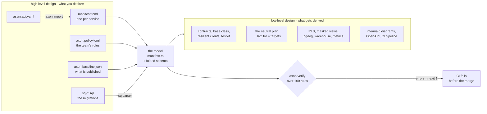
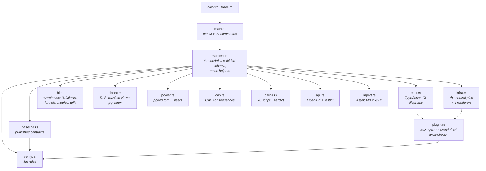
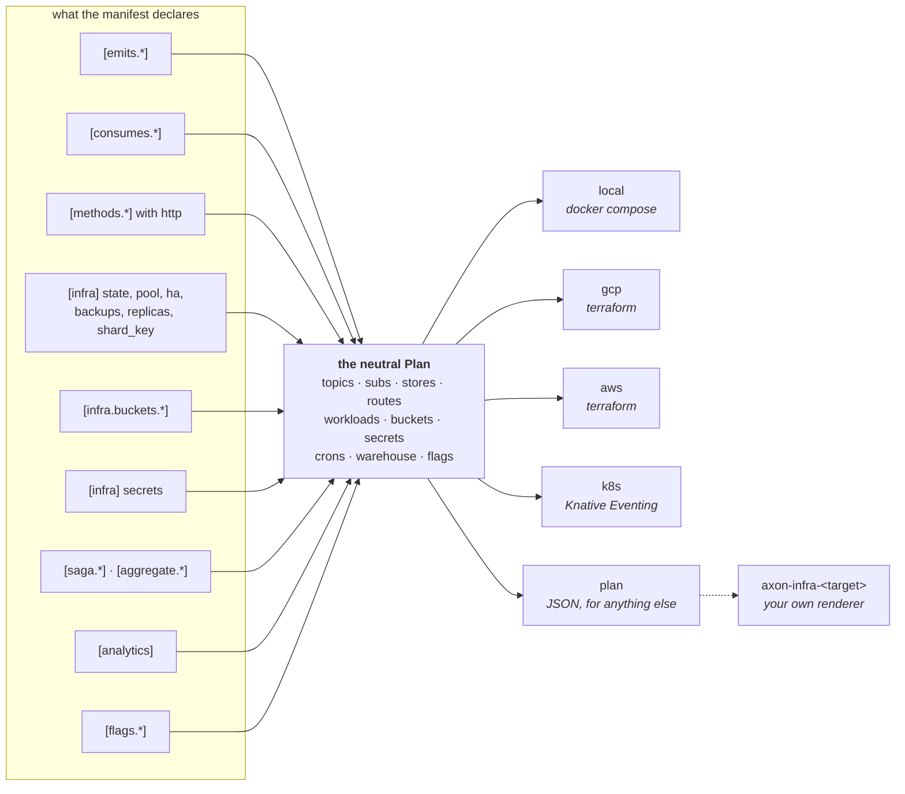
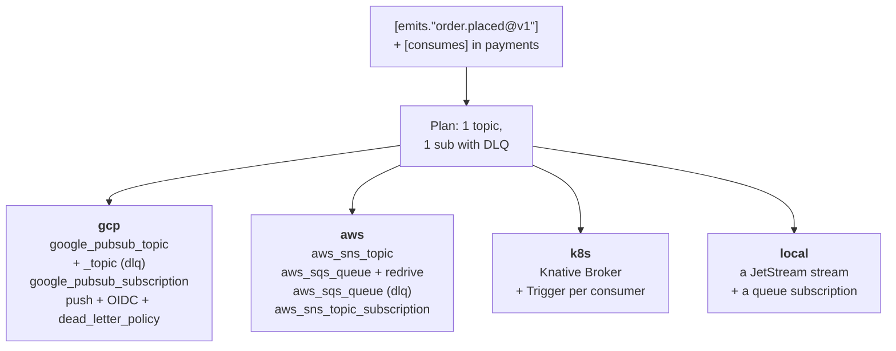
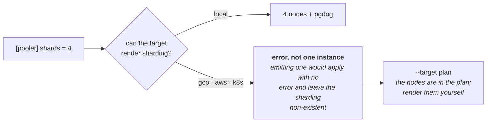
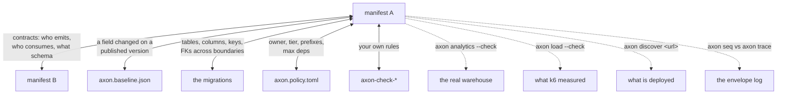
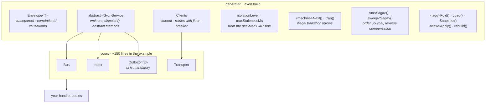
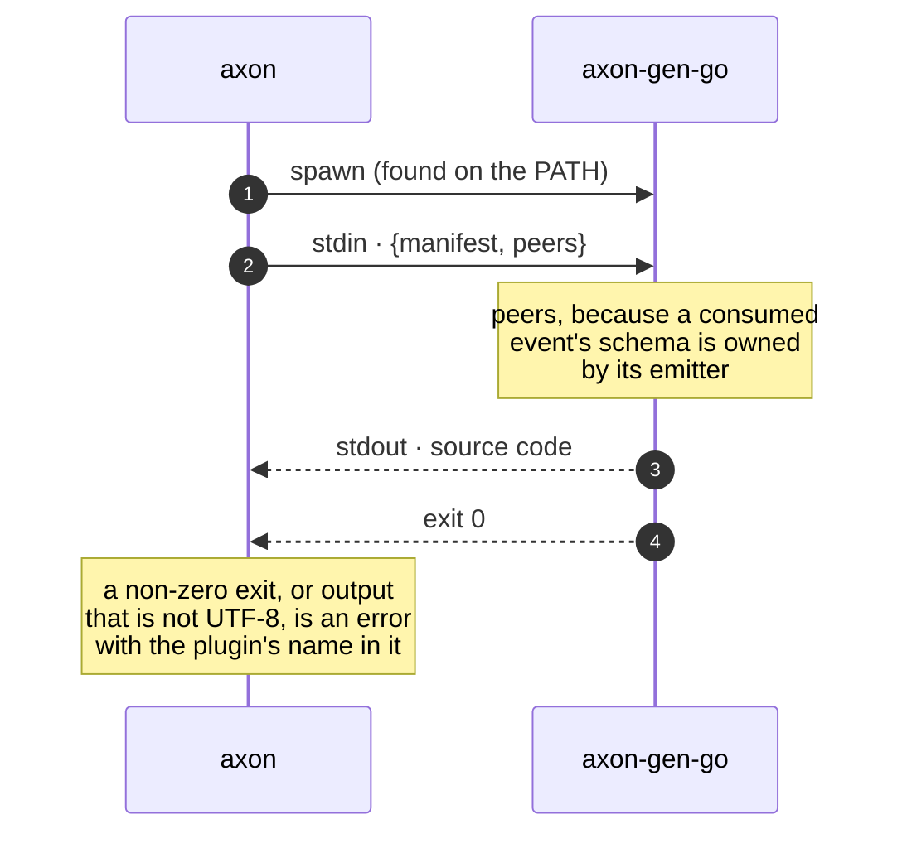

# Architecture: high and low level design

> **The manifest is high-level design** —service boundaries, topology, what each one
> guarantees— **and the compiler lowers it into low-level design**: isolation level, retry
> policy, method signatures, tables, infrastructure resources. And it verifies that they
> stay in agreement.

That sentence is the whole project. This page is what it looks like inside.

## The compiler, end to end

Two properties hold the whole thing up. **Nothing in the low-level column is edited by
hand** — if a diagram disagrees with the code, somebody broke the manifest. And **the
schema is read, never declared**: putting columns in the manifest would be the dual-write
problem dressed up as documentation, so the migrations are the source of truth and
`sqlparser` folds them in order.

## The modules

Each one takes the model and answers a different question. None of them knows about any
cloud provider except the four renderers inside `infra.rs`.

Six dependencies in the binary, none accidental: `clap`, `serde` + `toml` +
`serde_json` + `serde_yaml_ng`, `indexmap` (insertion order, so the generated output does
not change between runs and `git diff --exit-code` keeps meaning something), `sqlparser`
and `ureq`.

## Infrastructure, high level: one neutral plan

The manifest mentions **no provider**. `axon infra` builds a plan that mentions none
either, and only then renders it — which is why local and production cannot diverge: they
are two renders of the same plan.

The plan is the escape hatch that keeps the model honest: anything a renderer needs has to
exist in the plan first, in neutral vocabulary. A `{project}` placeholder is substituted by
each target with its own syntax, so no provider's grammar leaks into the middle.

## Infrastructure, low level: one declaration, four renders

This is the lowering. One `[emits."order.placed@v1"]` plus one `[consumes]` on the other
side becomes:

And the whole mapping, measured on this repo's own example — the counts are what
`axon infra examples --target …` emits today:

| declared | gcp | aws | k8s | local |
| --- | --- | --- | --- | --- |
| an event + its consumer | `google_pubsub_topic` ×2 (+dlq), `google_pubsub_subscription` | `aws_sns_topic`, `aws_sqs_queue` ×2, `aws_sns_topic_subscription` | `Broker` + `Trigger` | JetStream stream + queue sub |
| `[infra] state = "postgres"` | `google_sql_database_instance` + `_database` + `_user` | `aws_db_instance` + `aws_db_parameter_group` | — (no managed database) | one `postgres:16` per node |
| `ha`, `pitr`, `backup_retention_days` | `REGIONAL` + backup config + PITR | `multi_az`, retention (PITR follows) | — | — |
| `read_replicas = 2` | replica instances | `replicate_source_db` | — | — |
| `migrations = "sql/…"` | applied by your pipeline | idem | idem | a Flyway job per node |
| `pii` + `tenant_column` | `axon rls` → `R__rls.sql` | idem | idem | a second Flyway job, own history |
| `[pooler] shards = 4` | **refused** (see below) | **refused** | **refused** | 4 nodes + pgdog with its config |
| a `[methods.*]` with `http` | url_map + backend + NEG | `apigatewayv2_route` + `_integration` | `HTTPRoute` + `Gateway` | Traefik labels |
| the service itself | `google_cloud_run_v2_service` + service account | `aws_ecs_service` + `_task_definition` | `Deployment` + `Service` + `HPA` + `NetworkPolicy` | a container with a healthcheck |
| `[infra.buckets.*]` | `google_storage_bucket` (+ CDN backend) | `aws_s3_bucket` (+ CloudFront) | — | MinIO + a creation job |
| `secrets = […]` | `google_secret_manager_secret` | `aws_secretsmanager_secret` | `ExternalSecret` | `.env.local` |
| `[saga.*]` and snapshots | `google_cloud_scheduler_job` ×2 | `aws_scheduler_schedule` ×2 + a one-shot task | `CronJob` ×2 | a `curl` loop |
| `[analytics] warehouse` | Pub/Sub → BigQuery sub | Firehose → S3 | a Vector `Deployment` | ClickHouse + loader |
| `[flags.*]` | — (your provider) | — | — | flagd + its config |
| every service | OTel env vars, sampling from `tier` | idem | idem | Jaeger + full sampling |

Three of those cells say **refused**, and that is the design:

A generator that emits *something* for what it cannot express produces wrong output with
no error, which is the worst failure mode there is. The same refusal covers a warehouse
with no ingest path on the chosen target.

## The verification loop

`verify` is not a linter over one file: it is a comparison between things that live in
different places and drift apart quietly.

The solid lines are what the compiler compares on its own; the dotted ones are where it
compares its declaration against **reality**, and each needs somebody to hand it that
reality — axon does not have, nor want, credentials to your warehouse.

## What the generated code looks like at runtime

The last piece of lowering: the manifest's guarantees become types the compiler can
enforce, and four one-line interfaces you implement.

`Outbox<Tx>`'s mandatory `tx` is the clearest example of the whole idea: the pattern is
not documented, it is made **impossible to get wrong** — the event cannot be written
outside the transaction that changes the state, because there is nowhere to put it.

## How a plugin fits

No ABI, no dynamic loading, no version matching: `git`'s and `protoc`'s model.

The same shape covers the three kinds: `axon-gen-<lang>` receives the manifest and its
peers, `axon-infra-<target>` receives the neutral plan, and every `axon-check-*` on the
`PATH` receives every manifest and returns findings that block the pipeline exactly like a
native rule.
