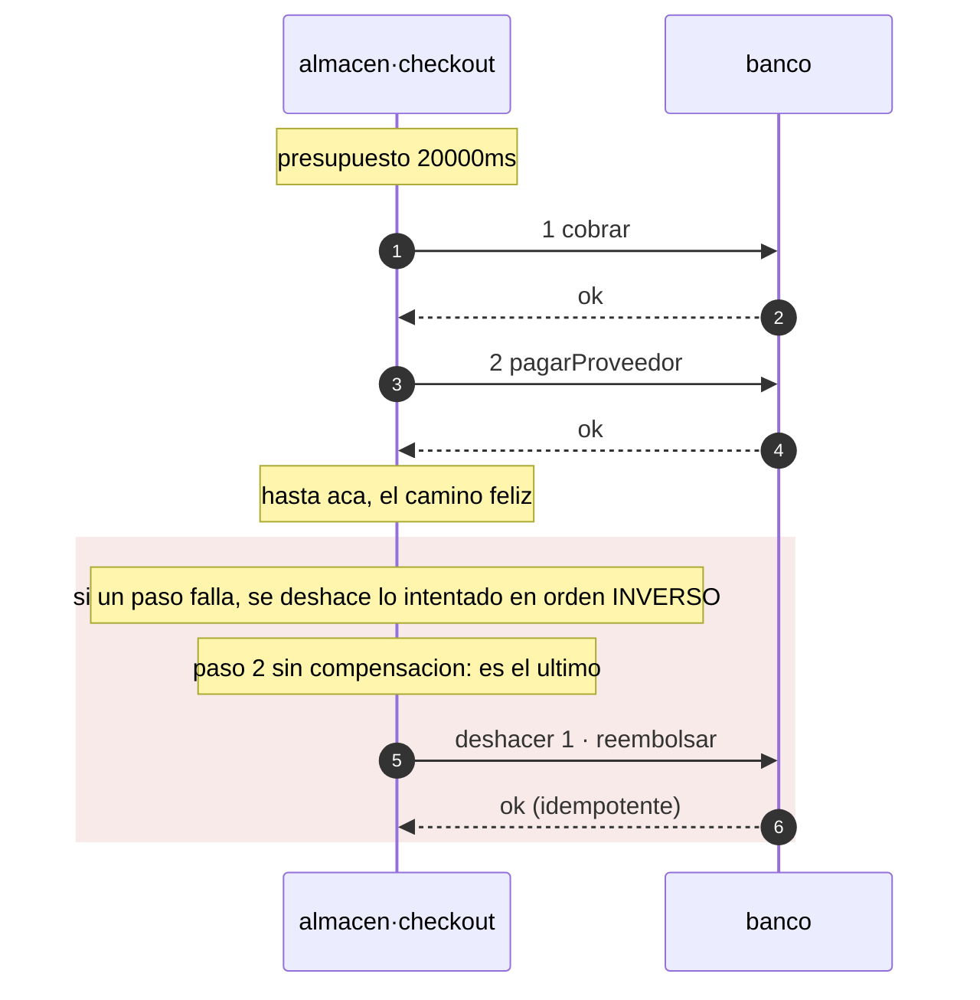

# Patrones

Un patrón que hay que acordarse de aplicar no es un patrón: es una convención que
alguien va a romper a las 3am. En axon el patrón se declara y el compilador lo emite.
Si no está en el código generado, no está.

| Patrón | Se declara | Qué produce |
| --- | --- | --- |
| **Transactional outbox** | `[patterns] outbox = true` | Los emisores escriben en el outbox; `bus.publish` **desaparece** del código generado. Adiós dual-write. |
| **Consumidor idempotente** | siempre | `dispatch()` deduplica por id de envelope antes de rutear. |
| **Cadena causal** | siempre | `traceparent` + `correlationId` + `causationId` propagados por el emisor. |
| **Dead letter** | siempre | Suscripción con DLQ en los cuatro targets. No hay forma de declarar un consumidor sin ella. |
| **Database per service** | `[infra] state` | Una base por servicio, y `verify` bloquea cualquier FK que cruce el límite. |
| **Circuit breaker / timeouts** | `[[depends]]` | `timeout_ms` obligatorio; reintentar algo no idempotente es un error. |
| **Idempotency-Key** | `idempotent = true` | Header obligatorio en el OpenAPI de todo método mutante. |
| **RFC 7807** | siempre | Un solo formato de error en toda la plataforma, con el `traceId` dentro. |
| **Expand / migrate / contract** | nombre del archivo | Un `DROP` fuera de un `.contract.sql` es un error de `verify`. |
| **Saga** | `[saga.<nombre>]` | El coordinador completo: orden, diario, compensación en orden inverso, y el barrido que retoma lo que quedó colgado. Un paso intermedio sin `undo` es un error. Ver [abajo](#saga). |

Los patrones GoF viven un nivel abajo, en el código que escribe el equipo — para eso
está [`gof-patterns`](https://github.com/Andrew-Tellez/patterns), en seis lenguajes.
axon se ocupa de los **arquitectónicos**: los que cruzan procesos y que ninguna
librería dentro de un lenguaje puede garantizar sola.

## Saga

Una saga es una secuencia de pasos en servicios distintos, cada uno con su
compensación, coordinada por uno de ellos. Es lo que queda cuando una transacción
distribuida no es una opción, y el precio es que **entre el primer paso y el último el
sistema pasa por estados que ningún invariante describe**.

```toml
[saga.checkout]
on         = "checkout"    # el metodo propio, o un evento consumido, que la arranca
timeout_ms = 20000         # el presupuesto del flujo completo
steps = [
  { do = "banco.cobrar",         undo = "banco.reembolsar" },
  { do = "banco.pagarProveedor" },   # el ultimo no lleva compensacion
]
```

### Qué se genera y qué no

El coordinador **completo**: el orden de los pasos, el diario, la compensación en orden
inverso, el presupuesto de tiempo y la tabla exhaustiva de pasos. Lo que no se genera son
las **entradas** de cada llamada, porque son datos de negocio. Eso es una interfaz que se
implementa, y un paso sin implementar no compila:

```ts
export interface CheckoutAcciones {
  /** paso 1 · banco.cobrar */
  paso1Cobrar(e: Envelope<unknown>): Promise<void>;
  /** deshace el paso 1 · banco.reembolsar · tiene que tolerar que no haya nada que deshacer */
  deshacer1Reembolsar(e: Envelope<unknown>): Promise<void>;
  /** paso 2 · banco.pagarProveedor */
  paso2PagarProveedor(e: Envelope<unknown>): Promise<void>;
}
```

Los pasos se invocan con los clientes que ya genera `[[depends]]`, así que llevan puesto
el timeout, los reintentos y el circuito. Por eso `verify` exige que todo paso esté
declarado como dependencia: sin eso la saga se genera y no tiene con qué llamar.

### Tres decisiones que el coordinador toma solo

**El paso que falló también se deshace.** Un timeout no dice que del otro lado no pasó
nada. Compensar sólo hasta el último éxito deja ese efecto aplicado para siempre. Por eso
toda compensación tiene que tolerar que no haya nada que deshacer.

**El diario se escribe en dos tiempos**: `intentando` antes de la llamada, `hecho`
después. Un paso que quedó en `intentando` puede haber ocurrido o no, así que al retomar
se **compensa**, no se reintenta.

**Una compensación que falla lanza `SagaAtascada`.** No hay nada detrás de una
compensación: si falla, la saga quedó a medias y necesita una persona. Tragarse ese error
la deja silenciosamente inconsistente, que es el peor resultado posible.

### El diario, y por qué es obligatorio

```sql
CREATE TABLE saga_checkout (
  id           uuid        PRIMARY KEY,  -- el id del flujo; el correlationId sirve
  paso         int         NOT NULL,
  estado       text        NOT NULL,
  datos        jsonb       NOT NULL,     -- el envelope que la arranco
  actualizado  timestamptz NOT NULL      -- cuando avanzo por ultima vez
);
```

`verify` la exige y comprueba sus columnas —y los tipos de las dos últimas— contra las
migraciones reales. Sin ella un reinicio a mitad de camino deja los pasos ya hechos
aplicados y **sin registro de cuáles fueron**: no se puede terminar ni compensar.

Las dos últimas columnas no son adorno:

- **`datos`** guarda el envelope que la arrancó. Retomar sin él es imposible: las acciones
  necesitan los datos de la llamada, y el proceso que los tenía en memoria es justo el que
  se murió.
- **`actualizado`** es lo que distingue una saga colgada de una que va en camino. Si se
  guarda como `text` la comparación compila y ordena mal, y el barrido **se saltaría sagas
  colgadas sin decir nada** — por eso `verify` comprueba el tipo, no sólo el nombre.

## El barrido: quién vuelve a llamar

El coordinador sabe retomar, pero por sí solo nadie lo llama: el proceso que tenía la saga
en vuelo es el que se murió. Sin un barrido, una saga con un paso en `intentando` se queda
ahí para siempre y el diario la registra sin que nadie lo lea.

Hay dos formas de correrlo, y las dos se generan:

**Dentro del proceso**, con el intervalo derivado del presupuesto:

```ts
const parar = arrancarBarridoCheckout(acciones, diario, (r) => {
  log.info({ barrido: "checkout", ...r });
  if (r.atascadas) log.error({ atascadas: r.atascadas });  // esto necesita una persona
});
```

**Disparado desde fuera**, que es lo que `axon infra` despliega. El código generado
publica la ruta y el arranque tiene que servirla:

```ts
export const rutaBarridoCheckout = "POST /internal/saga/checkout/barrer" as const;
```

Va por HTTP y no como un comando aparte porque un comando obliga a un entrypoint distinto
en cada lenguaje, y esto tiene que funcionar igual en el generador de Go que en el de
TypeScript. **Una ruta es el único contrato que todos comparten.** Y no es un método
declarado, así que no sale por el gateway: dispara compensaciones, no puede ser pública.

| target | qué se despliega |
| --- | --- |
| `local` | un contenedor con `curl` en bucle, para que el barrido corra también acá y no se descubra en producción que la ruta no existía |
| `gcp` | `google_cloud_scheduler_job` con OIDC de la misma cuenta del servicio |
| `aws` | `aws_scheduler_schedule` que lanza una tarea Fargate de un disparo **en las mismas subredes** — EventBridge no alcanza un endpoint privado, y una API destination tendría que ser pública |
| `k8s` | un `CronJob` con `concurrencyPolicy: Forbid`, y la `NetworkPolicy` del servicio deja entrar exactamente a ese pod |

Esa última fila es la que casi se fue rota: la política del servicio decía `ingress: []`, así
que el CronJob se habría aplicado sin error y el `curl` no habría llegado nunca. Lo único
que lo diría es el historial de un job que falla.

### El umbral no es una heurística

El barrido sólo toca las sagas que llevan **más de su propio presupuesto** sin moverse.
Ese número ya está declarado, y `verify` ya comprobó que cubre la suma de los pasos y sus
compensaciones: una saga más vieja que eso no está en camino, está colgada. Barrer antes
sería correr un **segundo coordinador sobre una saga viva**, compensando pasos que el
primero todavía está haciendo.

El intervalo sale del mismo número: nada se vuelve elegible antes, así que barrer más
seguido es trabajo sin resultado.

### `reclamar` reclama, no lista

Dos instancias del servicio barren a la vez. Si el barrido *listara* las sagas colgadas,
las dos tomarían la misma. En Postgres el reclamo y el filtro son **la misma sentencia**:

```sql
UPDATE saga_checkout SET actualizado = now()
 WHERE estado IN ('intentando','hecho') AND actualizado < $1
 RETURNING id, datos
```

Tocar `actualizado` *es* el reclamo: el otro barredor ya no la ve. Y si este proceso muere
a mitad, la saga vuelve a ser elegible en la siguiente ventana **sin que nadie la
desbloquee a mano** — un bloqueo que hay que limpiar a mano es un bloqueo que alguien va a
olvidar.

### Dos cosas que el barrido no hace

**No reintenta una `atascada`.** Una compensación que ya falló necesita una persona;
reintentarla en silencio esconde exactamente eso. Se cuenta y se deja.

**No se calla cuando no alcanza.** Si se llena el límite de la pasada, `pendientes` sale
`true`. Un tope silencioso se lee igual que «no había más», y esa es la diferencia entre un
barrido que va al día y uno que lleva semanas atrasado.

```ts
export interface SagaBarrido {
  reclamadas: number;
  completadas: number;
  compensadas: number;
  atascadas: number;    // necesitan una persona
  pendientes: boolean;  // quedaron para la proxima pasada
}
```

Devolver el resultado es lo que lo hace medible: **un barrido que no reporta nada es
indistinguible de uno que no corre.**

### Lo que `verify` refuta

| | |
| --- | --- |
| Un paso intermedio sin `undo` | eso no es una saga, es un dual-write con más pasos: si falla un paso posterior, este queda aplicado para siempre |
| Un `undo` que no es `idempotent` | una compensación se reintenta hasta que entra —no hay nada detrás— y reintentar la que no es idempotente **aplica el efecto dos veces** |
| `do` o `undo` que no existen | un `undo` mal escrito es una compensación que no existe, y se descubre el día que hay que compensar |
| Un paso sin `[[depends]]` | el cliente resiliente sale de ahí; sin él la saga no tiene con qué llamar |
| `timeout_ms` menor que la suma de los pasos y sus compensaciones | rendirse mientras un paso sigue en vuelo deja al coordinador compensando algo que después tiene éxito |
| Falta la tabla del diario, o le falta una columna | ver arriba |
| `on` que no es un método propio ni un evento consumido | una saga que nadie arranca es código generado que nunca corre |
| Un paso que se compensa consigo mismo | |
| `consistency = "strong"` | los estados intermedios son visibles: la garantía real del flujo es eventual |

El único carve-out es deliberado: **el último paso puede omitir `undo`**. Si falla el
último, no hay nada suyo que deshacer, y exigirle compensación sería un falso positivo —
y una regla con falsos positivos se silencia entera.

### El diagrama sale del manifiesto

```sh
axon seq checkout manifests/
```



Que la compensación se dibuje sola es la mitad del valor de declararla: en una revisión,
un paso sin flecha de vuelta se ve.

## Comprobado corriéndolo, no leyéndolo

El coordinador y el barrido generados se ejecutan con `node --test` y un diario en memoria
que cumple el mismo contrato que el de Postgres. **Diez casos**, porque el camino de vuelta
es justamente el que no se corre nunca hasta el día que importa:

| | |
| --- | --- |
| el camino feliz no compensa nada | |
| si el paso 2 falla, el paso 1 se deshace | y el orden es el inverso |
| si el paso 1 falla, no hay nada hecho que deshacer | se deshace igual: se intentó |
| una compensación que falla deja la saga atascada, y se nota | `SagaAtascada`, diario en `atascada` |
| el último paso no lleva compensación, y el resto sí | |
| el barrido retoma una saga colgada y la compensa | un paso en duda no se reintenta |
| el barrido no toca una saga que va en camino | sería un segundo coordinador |
| `reclamar` reclama: el segundo barredor no ve la misma saga | |
| una saga atascada se cuenta y no se reintenta | y no la vuelve a tomar |
| si se llena el límite, el barrido lo dice | |

El primer bug salió de ahí: el coordinador compensaba desde el último paso **exitoso** y
dejaba el paso fallido aplicado. Un timeout no dice que del otro lado no pasó nada.

## Lo que falta

La saga todavía no está en `examples/`, así que lo medido es el coordinador y el barrido
—corriéndolos— pero no una compensación contra contenedores reales. Y el `[[depends]]` de
un paso puede declarar `retries`, que el coordinador respeta a través del cliente
generado: la interacción entre esos reintentos y el reintento del barrido está declarada y
acotada por el presupuesto, pero no medida.
