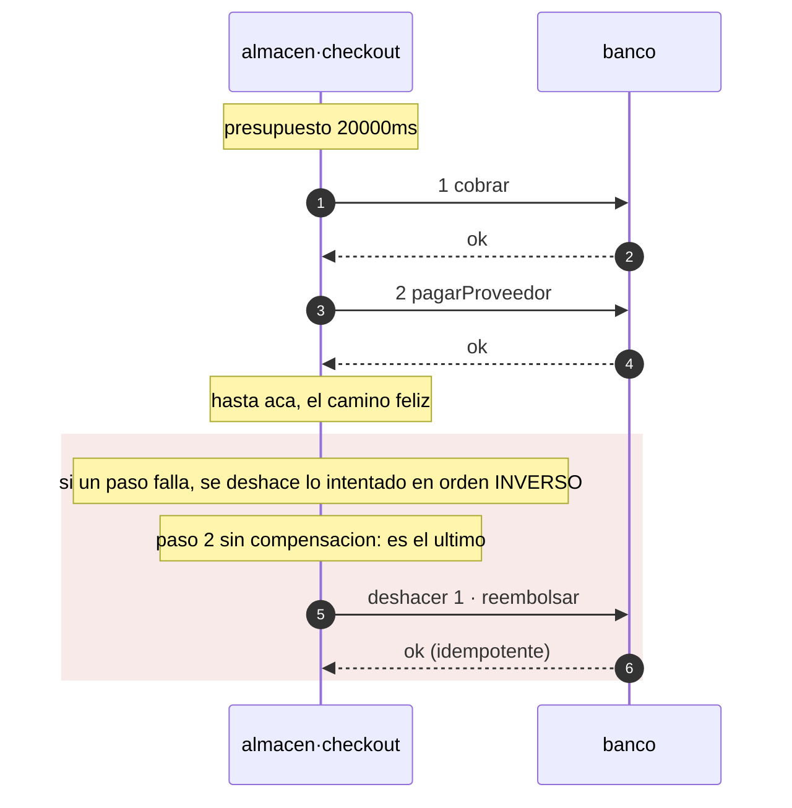

# Patrones

Un patrón que hay que acordarse de aplicar no es un patrón: es una convención que
alguien va a romper a las 3am. En axon el patrón se declara y el compilador lo emite.
Si no está en el código generado, no está.

| Patrón | Se declara | Qué produce |
| --- | --- | --- |
| **Transactional outbox** | `[patterns] outbox = true` | Los emisores escriben en el outbox; `bus.publish` **desaparece** del código generado. Adiós dual-write. |
| **Consumidor idempotente** | siempre | `dispatch()` deduplica por id de envelope antes de rutear. |
| **Cadena causal** | siempre | `traceparent` + `correlationId` + `causationId` propagados por el emisor. |
| **Dead letter** | siempre | Suscripción con DLQ en los cuatro targets. No hay forma de declarar un consumidor sin ella. |
| **Database per service** | `[infra] state` | Una base por servicio, y `verify` bloquea cualquier FK que cruce el límite. |
| **Circuit breaker / timeouts** | `[[depends]]` | `timeout_ms` obligatorio; reintentar algo no idempotente es un error. |
| **Idempotency-Key** | `idempotent = true` | Header obligatorio en el OpenAPI de todo método mutante. |
| **RFC 7807** | siempre | Un solo formato de error en toda la plataforma, con el `traceId` dentro. |
| **Expand / migrate / contract** | nombre del archivo | Un `DROP` fuera de un `.contract.sql` es un error de `verify`. |
| **Saga** | `[saga.<nombre>]` | El coordinador completo: orden, diario, y compensación en orden inverso. Un paso intermedio sin `undo` es un error. Ver [abajo](#saga). |

Los patrones GoF viven un nivel abajo, en el código que escribe el equipo — para eso
está [`gof-patterns`](https://github.com/Andrew-Tellez/patterns), en seis lenguajes.
axon se ocupa de los **arquitectónicos**: los que cruzan procesos y que ninguna
librería dentro de un lenguaje puede garantizar sola.

## Saga

Una saga es una secuencia de pasos en servicios distintos, cada uno con su
compensación, coordinada por uno de ellos. Es lo que queda cuando una transacción
distribuida no es una opción, y el precio es que **entre el primer paso y el último el
sistema pasa por estados que ningún invariante describe**.

```toml
[saga.checkout]
on         = "checkout"    # el metodo propio, o un evento consumido, que la arranca
timeout_ms = 20000         # el presupuesto del flujo completo
steps = [
  { do = "banco.cobrar",         undo = "banco.reembolsar" },
  { do = "banco.pagarProveedor" },   # el ultimo no lleva compensacion
]
```

### Qué se genera y qué no

El coordinador **completo**: el orden de los pasos, el diario, la compensación en orden
inverso, el presupuesto de tiempo y la tabla exhaustiva de pasos. Lo que no se genera son
las **entradas** de cada llamada, porque son datos de negocio. Eso es una interfaz que se
implementa, y un paso sin implementar no compila:

```ts
export interface CheckoutAcciones {
  /** paso 1 · banco.cobrar */
  paso1Cobrar(e: Envelope<unknown>): Promise<void>;
  /** deshace el paso 1 · banco.reembolsar · tiene que tolerar que no haya nada que deshacer */
  deshacer1Reembolsar(e: Envelope<unknown>): Promise<void>;
  /** paso 2 · banco.pagarProveedor */
  paso2PagarProveedor(e: Envelope<unknown>): Promise<void>;
}
```

Los pasos se invocan con los clientes que ya genera `[[depends]]`, así que llevan puesto
el timeout, los reintentos y el circuito. Por eso `verify` exige que todo paso esté
declarado como dependencia: sin eso la saga se genera y no tiene con qué llamar.

### Tres decisiones que el coordinador toma solo

**El paso que falló también se deshace.** Un timeout no dice que del otro lado no pasó
nada. Compensar sólo hasta el último éxito deja ese efecto aplicado para siempre. Por eso
toda compensación tiene que tolerar que no haya nada que deshacer.

**El diario se escribe en dos tiempos**: `intentando` antes de la llamada, `hecho`
después. Un paso que quedó en `intentando` puede haber ocurrido o no, así que al retomar
se **compensa**, no se reintenta.

**Una compensación que falla lanza `SagaAtascada`.** No hay nada detrás de una
compensación: si falla, la saga quedó a medias y necesita una persona. Tragarse ese error
la deja silenciosamente inconsistente, que es el peor resultado posible.

### El diario, y por qué es obligatorio

```sql
CREATE TABLE saga_checkout (
  id      uuid PRIMARY KEY,   -- el id del flujo; el correlationId sirve
  paso    int  NOT NULL,
  estado  text NOT NULL
);
```

`verify` la exige y comprueba sus columnas contra las migraciones reales. Sin ella un
reinicio a mitad de camino deja los pasos ya hechos aplicados y **sin registro de cuáles
fueron**: no se puede terminar ni compensar.

### Lo que `verify` refuta

| | |
| --- | --- |
| Un paso intermedio sin `undo` | eso no es una saga, es un dual-write con más pasos: si falla un paso posterior, este queda aplicado para siempre |
| Un `undo` que no es `idempotent` | una compensación se reintenta hasta que entra —no hay nada detrás— y reintentar la que no es idempotente **aplica el efecto dos veces** |
| `do` o `undo` que no existen | un `undo` mal escrito es una compensación que no existe, y se descubre el día que hay que compensar |
| Un paso sin `[[depends]]` | el cliente resiliente sale de ahí; sin él la saga no tiene con qué llamar |
| `timeout_ms` menor que la suma de los pasos y sus compensaciones | rendirse mientras un paso sigue en vuelo deja al coordinador compensando algo que después tiene éxito |
| Falta la tabla del diario, o le falta una columna | ver arriba |
| `on` que no es un método propio ni un evento consumido | una saga que nadie arranca es código generado que nunca corre |
| Un paso que se compensa consigo mismo | |
| `consistency = "strong"` | los estados intermedios son visibles: la garantía real del flujo es eventual |

El único carve-out es deliberado: **el último paso puede omitir `undo`**. Si falla el
último, no hay nada suyo que deshacer, y exigirle compensación sería un falso positivo —
y una regla con falsos positivos se silencia entera.

### El diagrama sale del manifiesto

```sh
axon seq checkout manifests/
```



Que la compensación se dibuje sola es la mitad del valor de declararla: en una revisión,
un paso sin flecha de vuelta se ve.

### Comprobado corriéndolo, no leyéndolo

El coordinador generado se ejecuta con `node --test` y acciones de mentira, y se comprueba
que el paso 1 quede **deshecho** cuando el paso 2 falla, que el orden sea el inverso, que
un paso que falló también se compense, y que una compensación fallida lance
`SagaAtascada` y cierre el diario en `atascada`. Cinco casos: es la única forma de saber
que el camino de vuelta funciona, porque es el que no se corre nunca hasta el día que
importa.

### Lo que falta

El coordinador corre en el proceso que lo llama. Si ese proceso muere, la saga queda con
un paso en `intentando` y **alguien tiene que volver a llamarla** para que retome: el
código para retomar está generado y probado, pero no hay quién lo dispare. Un barrido
periódico sobre el diario —las sagas abiertas más viejas que su presupuesto— es lo que
sigue.
