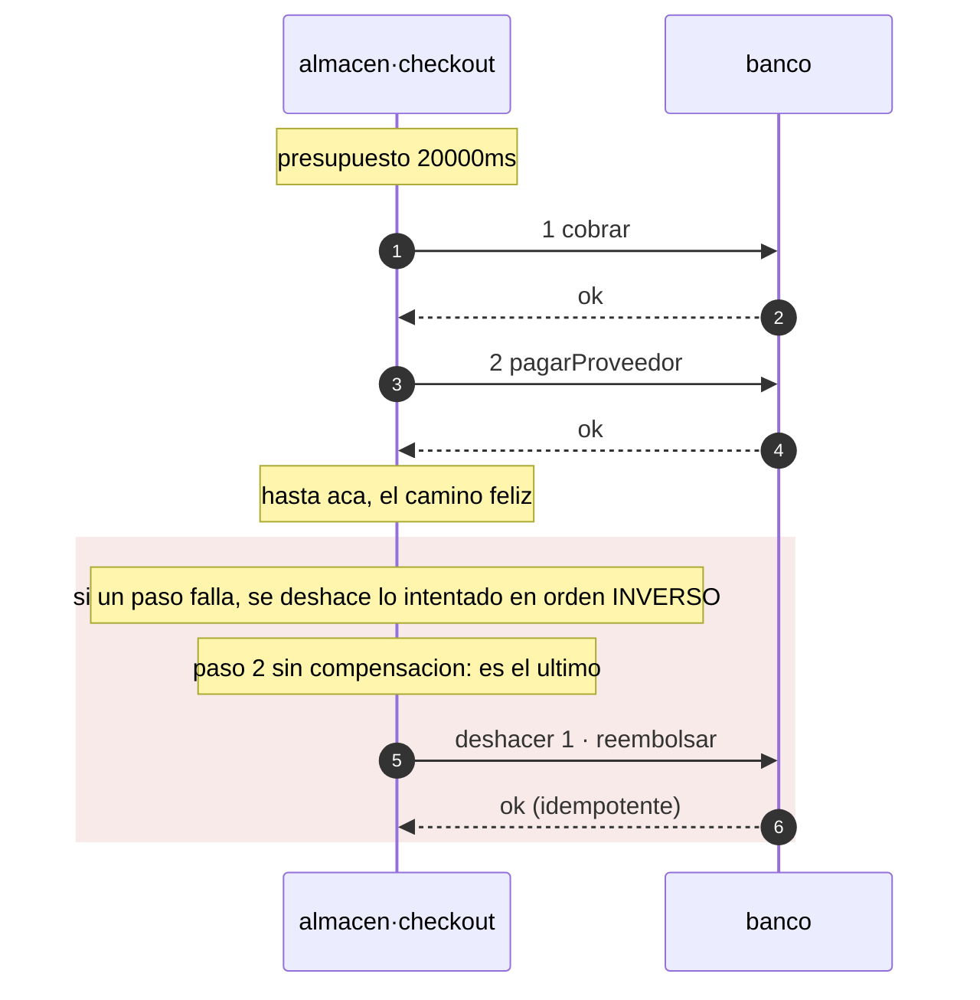

# Patrones

Un patrón que hay que acordarse de aplicar no es un patrón: es una convención que
alguien va a romper a las 3am. En axon el patrón se declara y el compilador lo emite.
Si no está en el código generado, no está.

| Patrón | Se declara | Qué produce |
| --- | --- | --- |
| **Transactional outbox** | `[patterns] outbox = true` | Los emisores escriben en el outbox y reciben la transacción de quien llama como parámetro **obligatorio**; `bus.publish` desaparece del código generado. Ver [abajo](#el-outbox-y-la-transacción-de-quien-llama). |
| **Consumidor idempotente** | siempre | `dispatch()` deduplica por id de envelope antes de rutear. |
| **Cadena causal** | siempre | `traceparent` + `correlationId` + `causationId` propagados por el emisor. |
| **Dead letter** | siempre | Suscripción con DLQ en los cuatro targets. No hay forma de declarar un consumidor sin ella. |
| **Database per service** | `[infra] state` | Una base por servicio, y `verify` bloquea cualquier FK que cruce el límite. |
| **Circuit breaker / timeouts** | `[[depends]]` | `timeout_ms` obligatorio; reintentar algo no idempotente es un error. |
| **Idempotency-Key** | `idempotent = true` | Header obligatorio en el OpenAPI de todo método mutante. |
| **RFC 7807** | siempre | Un solo formato de error en toda la plataforma, con el `traceId` dentro. |
| **Expand / migrate / contract** | nombre del archivo | Un `DROP` fuera de un `.contract.sql` es un error de `verify`. |
| **Event sourcing** | `[aggregate.<nombre>]` | La tienda append-only, el `fold` con un caso por evento declarado, y la versión optimista. Un `UPDATE` sobre el flujo es un error de `verify`, sin excepción. Ver [abajo](#event-sourcing). |
| **CQRS** | `[view.<nombre>]` | La proyección con un caso por evento y su checkpoint. Una vista que promete `strong`, o más atraso que el servicio, es un error. Ver [abajo](#cqrs-el-modelo-de-lectura). |
| **Saga** | `[saga.<nombre>]` | El coordinador completo: orden, diario, compensación en orden inverso, y el barrido que retoma lo que quedó colgado. Un paso intermedio sin `undo` es un error. Ver [abajo](#saga). |

Los patrones GoF viven un nivel abajo, en el código que escribe el equipo — para eso
está [`gof-patterns`](https://github.com/Andrew-Tellez/patterns), en seis lenguajes.
axon se ocupa de los **arquitectónicos**: los que cruzan procesos y que ninguna
librería dentro de un lenguaje puede garantizar sola.

## El outbox y la transacción de quien llama

```ts
export interface Outbox<Tx = unknown> {
  stage(e: Envelope<unknown>, tx: Tx): Promise<void>;
}

// y el emisor generado, cuando hay outbox:
protected emitPaymentCapturedV1(data: PaymentCapturedV1, tx: unknown, cause?: Envelope<unknown>)
```

`tx` es **obligatorio**, y eso es todo el punto: hace imposible escribir el evento fuera de
la transacción que cambia el estado. El tipo queda abierto porque el framework no elige
cliente de base.

### Esto estaba roto, y así se midió

La primera versión recibía el pool y abría su propia conexión. El resultado: el `stage` se
confirmaba solo, así que una transacción revertida dejaba el evento **sin su fila**, y el
relay publicaba un cobro que nunca ocurrió. Medido contra los contenedores, con un
interruptor que revienta después del `stage` y antes del `COMMIT`:

| | pagos | eventos en el outbox |
| --- | --- | --- |
| antes, con conexión propia | 0 | **1** |
| ahora, con la transacción de quien llama | 0 | 0 |

Un evento sin su fila no se ve en ninguna parte hasta que alguien pregunta por un cobro que
nadie hizo. Era exactamente el dual-write que el patrón existe para eliminar, en el código
que lo anunciaba como resuelto.

La comprobación se quedó en el demo como guardia de regresión, y el testkit exige el
parámetro en el código generado: un servicio con outbox tiene que pedir la transacción, y
uno sin outbox no —pedirla ahí sería ruido, porque no hay transacción que compartir.

## Saga

Una saga es una secuencia de pasos en servicios distintos, cada uno con su
compensación, coordinada por uno de ellos. Es lo que queda cuando una transacción
distribuida no es una opción, y el precio es que **entre el primer paso y el último el
sistema pasa por estados que ningún invariante describe**.

```toml
[saga.checkout]
on         = "checkout"    # el metodo propio, o un evento consumido, que la arranca
timeout_ms = 20000         # el presupuesto del flujo completo
steps = [
  { do = "banco.cobrar",         undo = "banco.reembolsar" },
  { do = "banco.pagarProveedor" },   # el ultimo no lleva compensacion
]
```

### Qué se genera y qué no

El coordinador **completo**: el orden de los pasos, el diario, la compensación en orden
inverso, el presupuesto de tiempo y la tabla exhaustiva de pasos. Lo que no se genera son
las **entradas** de cada llamada, porque son datos de negocio. Eso es una interfaz que se
implementa, y un paso sin implementar no compila:

```ts
export interface CompraSalidas {
  paso1?: PaymentsCapturePaymentOut;
  paso2?: PaymentsPayoutMerchantOut;
}

export interface CompraAcciones {
  /** paso 1 · payments.capturePayment */
  paso1CapturePayment(e: Envelope<unknown>, previas: CompraSalidas): Promise<PaymentsCapturePaymentOut>;
  /** deshace el paso 1 · payments.refundPayment · recibe lo que devolvieron los pasos
   *  anteriores, y tiene que tolerar que no haya nada que deshacer */
  deshacer1RefundPayment(e: Envelope<unknown>, previas: CompraSalidas): Promise<void>;
  /** paso 2 · payments.payoutMerchant */
  paso2PayoutMerchant(e: Envelope<unknown>, previas: CompraSalidas): Promise<PaymentsPayoutMerchantOut>;
}
```

`previas` está tipado con las salidas reales de los métodos declarados —los mismos tipos
que ya emite el cliente de cada dependencia— y **sale del diario, no de una variable**.
Esa es la diferencia entre una saga que se puede retomar y una que no: deshacer el paso 1
necesita el id que ese paso devolvió, y el proceso que lo tenía en memoria es justo el que
se murió.

Por eso todo lo que una acción necesita tiene que salir del envelope o de `previas`. Una
closure funciona en la primera pasada y desaparece en el retome, que es exactamente cuando
hace falta.

Los pasos se invocan con los clientes que ya genera `[[depends]]`, así que llevan puesto
el timeout, los reintentos y el circuito. Por eso `verify` exige que todo paso esté
declarado como dependencia: sin eso la saga se genera y no tiene con qué llamar.

### Tres decisiones que el coordinador toma solo

**El paso que falló también se deshace.** Un timeout no dice que del otro lado no pasó
nada. Compensar sólo hasta el último éxito deja ese efecto aplicado para siempre. Por eso
toda compensación tiene que tolerar que no haya nada que deshacer.

**El diario se escribe en dos tiempos**: `intentando` antes de la llamada, `hecho`
después. Un paso que quedó en `intentando` puede haber ocurrido o no, así que al retomar
se **compensa**, no se reintenta.

**Una compensación que falla lanza `SagaAtascada`.** No hay nada detrás de una
compensación: si falla, la saga quedó a medias y necesita una persona. Tragarse ese error
la deja silenciosamente inconsistente, que es el peor resultado posible.

### El diario, y por qué es obligatorio

```sql
CREATE TABLE saga_checkout (
  id           uuid        PRIMARY KEY,  -- el id del flujo; el correlationId sirve
  paso         int         NOT NULL,
  estado       text        NOT NULL,
  datos        jsonb       NOT NULL,     -- el envelope que la arranco
  actualizado  timestamptz NOT NULL      -- cuando avanzo por ultima vez
);
```

`verify` la exige y comprueba sus columnas —y los tipos de las dos últimas— contra las
migraciones reales. Sin ella un reinicio a mitad de camino deja los pasos ya hechos
aplicados y **sin registro de cuáles fueron**: no se puede terminar ni compensar.

Las dos últimas columnas no son adorno:

- **`datos`** guarda el envelope que la arrancó. Retomar sin él es imposible: las acciones
  necesitan los datos de la llamada, y el proceso que los tenía en memoria es justo el que
  se murió.
- **`actualizado`** es lo que distingue una saga colgada de una que va en camino. Si se
  guarda como `text` la comparación compila y ordena mal, y el barrido **se saltaría sagas
  colgadas sin decir nada** — por eso `verify` comprueba el tipo, no sólo el nombre.

## El barrido: quién vuelve a llamar

El coordinador sabe retomar, pero por sí solo nadie lo llama: el proceso que tenía la saga
en vuelo es el que se murió. Sin un barrido, una saga con un paso en `intentando` se queda
ahí para siempre y el diario la registra sin que nadie lo lea.

Hay dos formas de correrlo, y las dos se generan:

**Dentro del proceso**, con el intervalo derivado del presupuesto:

```ts
const parar = arrancarBarridoCheckout(acciones, diario, (r) => {
  log.info({ barrido: "checkout", ...r });
  if (r.atascadas) log.error({ atascadas: r.atascadas });  // esto necesita una persona
});
```

**Disparado desde fuera**, que es lo que `axon infra` despliega. El código generado
publica la ruta y el arranque tiene que servirla:

```ts
export const rutaBarridoCheckout = "POST /internal/saga/checkout/barrer" as const;
```

Va por HTTP y no como un comando aparte porque un comando obliga a un entrypoint distinto
en cada lenguaje, y esto tiene que funcionar igual en el generador de Go que en el de
TypeScript. **Una ruta es el único contrato que todos comparten.** Y no es un método
declarado, así que no sale por el gateway: dispara compensaciones, no puede ser pública.

| target | qué se despliega |
| --- | --- |
| `local` | un contenedor con `curl` en bucle, para que el barrido corra también acá y no se descubra en producción que la ruta no existía |
| `gcp` | `google_cloud_scheduler_job` con OIDC de la misma cuenta del servicio |
| `aws` | `aws_scheduler_schedule` que lanza una tarea Fargate de un disparo **en las mismas subredes** — EventBridge no alcanza un endpoint privado, y una API destination tendría que ser pública |
| `k8s` | un `CronJob` con `concurrencyPolicy: Forbid`, y la `NetworkPolicy` del servicio deja entrar exactamente a ese pod |

Esa última fila es la que casi se fue rota: la política del servicio decía `ingress: []`, así
que el CronJob se habría aplicado sin error y el `curl` no habría llegado nunca. Lo único
que lo diría es el historial de un job que falla.

### El umbral no es una heurística

El barrido sólo toca las sagas que llevan **más de su propio presupuesto** sin moverse.
Ese número ya está declarado, y `verify` ya comprobó que cubre la suma de los pasos y sus
compensaciones: una saga más vieja que eso no está en camino, está colgada. Barrer antes
sería correr un **segundo coordinador sobre una saga viva**, compensando pasos que el
primero todavía está haciendo.

El intervalo sale del mismo número: nada se vuelve elegible antes, así que barrer más
seguido es trabajo sin resultado.

### `reclamar` reclama, no lista

Dos instancias del servicio barren a la vez. Si el barrido *listara* las sagas colgadas,
las dos tomarían la misma. En Postgres el reclamo y el filtro son **la misma sentencia**:

```sql
UPDATE saga_checkout SET actualizado = now()
 WHERE estado IN ('intentando','hecho') AND actualizado < $1
 RETURNING id, datos
```

Tocar `actualizado` *es* el reclamo: el otro barredor ya no la ve. Y si este proceso muere
a mitad, la saga vuelve a ser elegible en la siguiente ventana **sin que nadie la
desbloquee a mano** — un bloqueo que hay que limpiar a mano es un bloqueo que alguien va a
olvidar.

### Dos cosas que el barrido no hace

**No reintenta una `atascada`.** Una compensación que ya falló necesita una persona;
reintentarla en silencio esconde exactamente eso. Se cuenta y se deja.

**No se calla cuando no alcanza.** Si se llena el límite de la pasada, `pendientes` sale
`true`. Un tope silencioso se lee igual que «no había más», y esa es la diferencia entre un
barrido que va al día y uno que lleva semanas atrasado.

```ts
export interface SagaBarrido {
  reclamadas: number;
  completadas: number;
  compensadas: number;
  atascadas: number;    // necesitan una persona
  pendientes: boolean;  // quedaron para la proxima pasada
}
```

Devolver el resultado es lo que lo hace medible: **un barrido que no reporta nada es
indistinguible de uno que no corre.**

### Lo que `verify` refuta

| | |
| --- | --- |
| Un paso intermedio sin `undo` | eso no es una saga, es un dual-write con más pasos: si falla un paso posterior, este queda aplicado para siempre |
| Un `undo` que no es `idempotent` | una compensación se reintenta hasta que entra —no hay nada detrás— y reintentar la que no es idempotente **aplica el efecto dos veces** |
| `do` o `undo` que no existen | un `undo` mal escrito es una compensación que no existe, y se descubre el día que hay que compensar |
| Un paso sin `[[depends]]` | el cliente resiliente sale de ahí; sin él la saga no tiene con qué llamar |
| `timeout_ms` menor que la suma de los pasos y sus compensaciones | rendirse mientras un paso sigue en vuelo deja al coordinador compensando algo que después tiene éxito |
| Falta la tabla del diario, o le falta una columna | ver arriba |
| `on` que no es un método propio ni un evento consumido | una saga que nadie arranca es código generado que nunca corre |
| Un paso que se compensa consigo mismo | |
| `consistency = "strong"` | los estados intermedios son visibles: la garantía real del flujo es eventual |

El único carve-out es deliberado: **el último paso puede omitir `undo`**. Si falla el
último, no hay nada suyo que deshacer, y exigirle compensación sería un falso positivo —
y una regla con falsos positivos se silencia entera.

### El diagrama sale del manifiesto

```sh
axon seq checkout manifests/
```



Que la compensación se dibuje sola es la mitad del valor de declararla: en una revisión,
un paso sin flecha de vuelta se ve.

## Comprobado corriéndolo, no leyéndolo

El coordinador y el barrido generados se ejecutan con `node --test` y un diario en memoria
que cumple el mismo contrato que el de Postgres. **Diez casos**, porque el camino de vuelta
es justamente el que no se corre nunca hasta el día que importa:

| | |
| --- | --- |
| el camino feliz no compensa nada | |
| si el paso 2 falla, el paso 1 se deshace | y el orden es el inverso |
| si el paso 1 falla, no hay nada hecho que deshacer | se deshace igual: se intentó |
| una compensación que falla deja la saga atascada, y se nota | `SagaAtascada`, diario en `atascada` |
| el último paso no lleva compensación, y el resto sí | |
| el barrido retoma una saga colgada y la compensa | un paso en duda no se reintenta |
| el barrido no toca una saga que va en camino | sería un segundo coordinador |
| `reclamar` reclama: el segundo barredor no ve la misma saga | |
| una saga atascada se cuenta y no se reintenta | y no la vuelve a tomar |
| si se llena el límite, el barrido lo dice | |

El primer bug salió de ahí: el coordinador compensaba desde el último paso **exitoso** y
dejaba el paso fallido aplicado. Un timeout no dice que del otro lado no pasó nada.

## En el demo, contra contenedores

`examples/` trae un tercer servicio, `checkout`, cuyo único trabajo es coordinar la saga
sobre `payments`. Su base **no se reparte por inquilino**, y esa decisión es del diseño:
el barrido tiene que poder mirar todas las sagas colgadas de una vez, y una consulta sin
la clave de reparto no se puede rutear. El inquilino viaja dentro de `datos`.

`payments.payoutMerchant` rechaza los montos que superan el tope del comercio, que es un
fallo de negocio realista y determinista: ocurre **después** de haber cobrado. Es
exactamente el caso que hace falta una saga.

```console
==> la saga: compensacion y retome, medidos
  una compra por debajo del tope
    {"estado":"completada"}
  una compra por ENCIMA del tope: el paso 2 falla despues de cobrar
    {"estado":"compensada"}
  OK: el cobro se deshizo y al comercio no se le pago
  una saga colgada en otro proceso, retomada por el barrido
    {"reclamadas":1,"completadas":0,"compensadas":1,"atascadas":0,"pendientes":false}
  OK: retomada desde el diario, compensada, y el reembolso alcanzo al cobro
  OK: una saga cerrada no se vuelve a barrer
```

El tercer caso es el que no se puede simular con una closure: se inserta en el diario una
saga cuyo paso 1 quedó `hecho` **en otro proceso**, con su salida guardada, y se golpea la
ruta del barrido. El reembolso tiene que alcanzar a ese cobro concreto, y el único lugar
de donde puede salir el `paymentId` es el diario.

Ahí salió el bug que ningún test unitario había visto: el diario guarda las salidas por
**número** de paso y la interfaz las expone como `paso1`. El cast de una forma a la otra
compilaba y dejaba todo en `undefined`, así que la compensación de una saga retomada no
reembolsaba nada —y no fallaba—. Ahora la traducción es explícita, campo por campo.

Y las afirmaciones son sobre el **invariante**, no sobre conteos: de ese pedido no queda
ningún cobro en pie y al comercio no se le pagó nada. Un conteo acumula corridas
anteriores y termina afirmando sobre otra cosa.

## Los reintentos, medidos

`[[depends]]` declara `retries` por paso, y el coordinador los aplica a través del cliente
generado. El demo mide que sean **exactamente** esos, y que sean lo que decide si una saga
se compensa o se atasca.

Lo declarado no sale de un número escrito en el script: sale del **código generado** —
`withPolicy("payments.payoutMerchant", { timeoutMs: 4000, retries: 2, ... })` — y el
presupuesto, del `const limite = Date.now() + 60000` del coordinador. Comparar contra una
copia a mano no compara nada. Lo medido sale de la tabla `intento` de `payments`, que
registra cada llamada que llegó.

```console
==> reintentos declarados vs ocurridos
  declarado en el generado: payout 2 reintentos, refund 3
    {"estado":"compensada"}  (14s)
  OK: 3 llamadas = 1 + 2 reintentos, exactamente lo declarado
  OK: 14000ms dentro del presupuesto de 60000ms
    {"estado":"compensada"}
  OK: 3 llamadas al reembolso (2 fallos y la que entro), y el cobro quedo deshecho
  i sin los 3 reintentos declarados, esta saga terminaba ATASCADA
    HTTP 500
  OK: 4 llamadas, la saga quedo ATASCADA y la respuesta no lo oculto
```

Cuatro cosas, y cada una responde a una pregunta distinta:

| | |
| --- | --- |
| **el paso reintenta lo declarado, y ni una vez más** | el payout tarda más que su propio timeout, así que cada intento se agota. Llegan 3 llamadas: `1 + retries` |
| **agotar los reintentos cabe en el presupuesto** | 14000ms contra los 60000ms declarados. Es lo que hace que rendirse por tiempo signifique algo y no sea un límite que se cruza siempre |
| **los reintentos de la compensación son lo que salva la saga** | el reembolso falla dos veces y entra a la tercera. Con `retries = 3` hay margen: la saga termina `compensada`. Sin ellos, `atascada` |
| **agotarlos no queda en silencio** | con más fallos que reintentos, la saga queda `atascada` en el diario **y** la respuesta es un 500. Una saga a medias que devuelve 200 es el peor resultado posible |

Los dos interruptores que provocan los fallos —un payout lento y un reembolso que rechaza
las primeras N veces— son del **demo, no del servicio**: viajan por `.env.local`, que es el
`env_file` que el compose generado ya monta. Una variable en el shell no entra al
contenedor si el compose no la declara, y declararla ahí sería meter algo del demo dentro
de la infraestructura generada.

Y el registro de intentos vive en `tenant_exempt` por escrito: es infraestructura de la
política de reintentos, no dato de inquilino. Sin esa declaración explícita, la regla de
RLS lo marcaría —correctamente— y dejaría de servir para el resto.

## Event sourcing

El estado **es** el flujo de eventos. Lo que hoy vive en una fila es una proyección de ese
flujo, no la verdad.

```toml
[aggregate.cuenta]
events  = ["cuenta.abierta@v1", "cuenta.depositada@v1", "cuenta.cerrada@v1"]
machine = "cuenta"        # opcional: gobierna qué evento es legal desde qué estado
snapshot_every = 0        # 0 = reconstruir desde el principio siempre
```

```sql
CREATE TABLE cuenta_event (
  id         uuid PRIMARY KEY,
  stream_id  uuid NOT NULL,
  version    int  NOT NULL,
  type       text NOT NULL,
  data       jsonb NOT NULL,
  en         timestamptz NOT NULL DEFAULT now(),
  UNIQUE (stream_id, version)
);
```

### Ese UNIQUE no es un detalle

Es la versión optimista entera. Sin él, dos escrituras concurrentes sobre el mismo flujo
**entran las dos con la misma versión**, nadie ve un error, y el estado que se reconstruye
después depende de en qué orden se lean las filas. `axon verify` lo exige.

```console
$ axon verify manifests/
error  libro.cuenta: `cuenta_event` sin UNIQUE sobre (stream_id, version). Dos escrituras
       concurrentes sobre el mismo flujo entran las dos con la misma version, sin un solo
       error, y el estado que se reconstruye depende de en que orden se lean
```

### Append-only, y no como recomendación

```console
error  libro/002_arreglo.contract.sql: `DELETE` sobre `cuenta_event`, que es el flujo de
       `cuenta`. Un flujo es append-only: cambiar un evento pasado deja un pasado que no
       ocurrio, y todo lo que se reconstruya despues va a ser coherente con esa mentira.
       Para corregir se agrega un evento nuevo, no se edita el viejo
```

A diferencia del resto de las tablas, aquí **no hay `.contract.sql` que lo habilite**. Una
migración destructiva sobre una tabla normal es una decisión que se marca y se revisa;
sobre un flujo de eventos es una contradicción con lo que el flujo significa.

### Qué se genera y qué no

Lo mecánico se genera: `append` con versión esperada, la rehidratación, y el `switch` con
un caso por evento declarado. Cómo cada evento cambia el estado lo escribe quien lo sabe:

```ts
export interface CuentaReglas<CuentaEstado> {
  inicial(streamId: string): CuentaEstado;
  aplicarCuentaAbiertaV1(estado: CuentaEstado, e: CuentaAbiertaV1): CuentaEstado;
  aplicarCuentaDepositadaV1(estado: CuentaEstado, e: CuentaDepositadaV1): CuentaEstado;
  aplicarCuentaCerradaV1(estado: CuentaEstado, e: CuentaCerradaV1): CuentaEstado;
}
```

Un evento declarado sin su caso **no compila**. Es la única forma de que agregar un evento
al manifiesto no deje el `fold` viejo corriendo en silencio, devolviendo un estado
incompleto que nadie distingue de uno correcto.

Y el `fold` generado no asume el orden: **un hueco en las versiones revienta**. Reconstruir
salteándose un evento da un estado que nunca existió, y es indistinguible de uno real.

```ts
if (ev.version !== version + 1) {
  throw new Error(`cuenta/${streamId}: se esperaba la version ${version + 1} y llego ${ev.version}`);
}
```

### La máquina de estados, si la hay

`machine = "cuenta"` conecta el agregado con `[machine.cuenta]`, y entonces `verify` exige
que **cada evento del agregado sea emitido por alguna transición**. Dos vocabularios para
el mismo concepto se separan en el primer cambio; con esta regla, no pueden.

## CQRS: el modelo de lectura

```toml
[view.saldos]
on = ["cuenta.abierta@v1", "cuenta.depositada@v1"]
max_staleness_ms = 3000
```

Lo que aporta declararla no es el código —una proyección es un `switch`— sino que el
compilador imponga lo que nadie impone:

| | |
| --- | --- |
| se construye con un evento que nadie emite | la vista se genera y nunca recibe nada |
| usa un evento de otro servicio sin `[consumes]` | la suscripción sale de ahí; sin ella, lo mismo |
| falta su tabla, o la del checkpoint | ver abajo |
| `consistency = "strong"` | una vista se llena **después** de que el evento ocurrió: lo que sirve es un dato viejo por definición |
| `max_staleness_ms` mayor que el del servicio | el servicio no puede cumplir lo que prometió sirviendo de una vista más vieja que su propio presupuesto |

### El checkpoint, y por qué la escritura no está en la interfaz

```ts
export interface Checkpoint {
  leer(vista: string): Promise<number>;
}

export interface SaldosProyeccion {
  /** cuenta.abierta@v1 · guarda `posicion` en la MISMA transaccion que el efecto */
  aplicarCuentaAbiertaV1(e: Envelope<CuentaAbiertaV1>, posicion: number): Promise<void>;
  ...
}
```

La posición **tiene que guardarse en la misma transacción que el efecto de la vista**, y esa
transacción es de la proyección, no del framework. Por eso `Checkpoint` sólo sabe leer: la
posición viaja a cada `aplicar*`, que la guarda junto con el resto.

Si fueran dos transacciones, un corte entre ellas deja la vista adelantada o atrasada
respecto de lo que dice haber aplicado — y ninguna de las dos cosas da un error. Sin
checkpoint, directamente, un reinicio reprocesa desde el principio o se salta lo que no
alcanzó a aplicar.

## El fold, comprobado corriéndolo

El `fold` y la proyección generados se ejecutan con `node --test`. **Seis casos**, y los tres
que importan son los que un `switch` leído a ojo no distingue:

| | |
| --- | --- |
| el estado sale del flujo, no de una fila | |
| **un hueco en las versiones revienta** | en vez de dar un estado que nunca existió |
| **un evento que el manifiesto no declara no se ignora** | ignorarlo da un estado incorrecto sin error |
| desde una foto, el `fold` sigue desde ahí | |
| los eventos del agregado son los del manifiesto | |
| **la vista sólo acepta los eventos que declara, y le llega la posición** | un evento de más vendría de una suscripción que nadie pidió |

## En el demo, contra Postgres

`checkout` declara `[aggregate.compra]` y `[view.conversion]`, y el demo mide las dos
afirmaciones que un test unitario no puede sostener:

```console
==> event sourcing y CQRS, medidos
  OK: una entro y la otra fue rechazada; queda 1 evento en la version 3
  i el rechazo es el UNIQUE, no una comprobacion de la aplicacion
  OK: la vista concuerda con el flujo
  OK: 1061ms de atraso real; el evento sin proyectar se ve
  OK: 0ms, dentro del presupuesto declarado de 3000ms
```

**La concurrencia optimista.** Dos `INSERT` a la misma versión, a la vez, con un
`pg_sleep` dentro de cada transacción para solaparlas a propósito. Una entra, la otra la
rechaza el UNIQUE — no una comprobación de la aplicación, que es la diferencia entre una
garantía y una intención.

**El atraso, medido del flujo y no de la vista.** Esto estaba mal en mi primera versión:
medía la edad del evento que la vista ya había aplicado, y eso da siempre un número bonito
—justo cuando la proyección está parada—. El atraso real es la edad del evento **más viejo
que la proyección todavía no aplicó**, y sale del flujo.

Y se mide en las dos direcciones, porque una medición que sólo se ha visto pasar no se ha
visto funcionar: sobre un flujo con un evento inyectado sin pasar por la proyección tiene
que **ver** el atraso, y sobre una compra al día tiene que caber en el presupuesto.

### El relay, y por qué `verify` lo exige

Con event sourcing el flujo ya es durable, así que **nadie publica en línea**:

```console
$ axon verify manifests/
error  checkout.compra: un agregado cuyos eventos se publican necesita `[patterns] outbox
       = true`. El flujo ya es durable, asi que publicar en linea deja una ventana en la
       que el evento esta anotado y nadie lo recibio, y publicar antes de anotar deja lo
       contrario. El traspaso va en la MISMA transaccion que el append
```

Las dos filas —el evento del flujo y la del outbox— entran en **una** transacción, o no
entra ninguna. El flujo es la verdad; el outbox es la entrega. Y como el outbox no es el
flujo, el relay puede marcar lo publicado sin violar el append-only: por eso hacen falta
las dos tablas y no una con una columna `publicado`.

Al escribirlo apareció algo que el generador todavía no resuelve: **el `Outbox` generado no
sirve aquí**, porque `stage` abre su propia conexión, y una segunda transacción es
exactamente el problema que esto evita. En el ejemplo, `append` escribe las dos filas él
mismo.

Y una consecuencia del orden: la versión esperada sale de **leer** el flujo, no de un
contador en memoria. Con dos instancias, un contador local se desincroniza y el UNIQUE es
lo único que lo dice.

Lo que eso compra, medido: un evento anotado **con el relay caído** se publica cuando
vuelve, y nadie tiene que reintentarlo a mano.

```console
  un evento anotado con el relay caido
    1 evento(s) anotado(s) y sin publicar
  OK: el relay volvio y lo publico; nadie tuvo que reintentarlo a mano
```

El demo lo comprueba en las dos mitades: que la fila del outbox quede marcada, **y** que el
envelope aparezca en el log del bus. Marcar sin publicar es el fallo silencioso que un
`published_at` a solas no distingue.

## Las fotos, y por qué llevan versión de reglas

Reconstruir desde el principio funciona hasta que un flujo tiene cien mil eventos.

```toml
[aggregate.compra]
events = ["compra.iniciada@v1", "compra.cobrada@v1", "compra.compensada@v1"]
snapshot_every   = 50
snapshot_version = 1
```

Una foto es una **cache del `fold`**: se pueden borrar todas y el sistema sigue siendo
correcto, sólo más lento. Eso es lo que la distingue del flujo, y también de dónde sale su
único peligro real.

**Lo peligroso no es que falte una foto** —eso cuesta tiempo— **sino que esté mal.** Si el
`fold` cambia —una regla nueva, un campo que ahora se acumula distinto— las fotos viejas
codifican la versión anterior. Rehidratar de ahí da un estado que ya no coincide con
reproducir el flujo, y eso no da ningún error: da un número equivocado.

De ahí `snapshot_version`. Va en la tabla, y `foto()` devuelve **sólo** las de la versión
vigente:

```sql
CREATE TABLE compra_snapshot (
  stream_id  uuid  NOT NULL,
  version    int   NOT NULL,
  reglas     int   NOT NULL,   -- con que version de las reglas se calculo
  estado     jsonb NOT NULL,
  en         timestamptz NOT NULL DEFAULT now(),
  PRIMARY KEY (stream_id, version, reglas)
);
```

`verify` exige esa columna con ese razonamiento en el mensaje. Subir el número invalida las
fotos existentes y las hace reconstruir: es lo único que convierte «la foto quedó mal» en
«la foto se reconstruye» — la diferencia entre un número equivocado y una consulta lenta.

### El ciclo se genera, con los números dentro

```ts
export const compraFotoCada   = 50;
export const compraFotoReglas = 1;

/** De la ultima foto valida, y solo el resto del flujo desde ahi. */
export async function compraCargar<E>(reglas, flujo: FlujoConFotos, streamId)
/** Fotografia si toca. Devuelve si la guardo, para poder medirlo. */
export async function compraFotografiar<E>(flujo, streamId, version, estado)
```

Los dos números salen del manifiesto: nadie los teclea dos veces. Y `FlujoConFotos` sólo se
genera si el manifiesto declara fotos — en `FlujoEventos` eran métodos opcionales, y
declarar fotos sin implementarlas compilaba y no hacía nada.

Un detalle del orden: la foto se saca **después** del append y de un estado recién
reconstruido. Fotografiar lo que se creía el estado antes de escribir guardaría una foto de
algo que no quedó en el flujo.

### Medido

```console
  OK: foto en la version 2, multiplo de la cadencia declarada (2)
  OK: la foto dice 'compensada' y la proyeccion, que no la uso, dice lo mismo
  OK: la foto de reglas 0 convive con la vigente, que dice 900 centavos
```

La segunda es la que importa: **la foto contra la vista**, que se construyó evento por
evento sin usar fotos. Si difirieran, la cache estaría mintiendo.

Y el testkit prueba lo que el demo no puede: que una foto de otra versión de reglas **no se
use**. Se le da al `cargar` un flujo con una foto guardada de la versión equivocada, que
diría 99999 centavos, y el estado tiene que salir del flujo entero: 750.

`snapshot_every = 1` es un aviso, no un error: guardar una foto por evento no es una cache,
es una segunda copia del flujo con el doble de escrituras.

### Borrar las viejas

`snapshot_version` invalida las fotos viejas pero no las quita, así que la tabla crece con
cada versión de reglas. La limpieza borra **lo que la versión vigente no usa**: las de otra
versión de reglas, y todas menos la más nueva de cada flujo.

```ts
export const rutaLimpiezaCompra = "POST /internal/aggregate/compra/limpiar" as const;
export async function limpiarCompra(flujo: FlujoConFotos): Promise<number>
```

Y `axon infra` la despliega en los cuatro targets, con la misma maquinaria que el barrido
de sagas. El intervalo —una hora— **no sale del manifiesto**, y eso es deliberado: no hay
nada ahí de donde derivarlo, porque la cadencia de fotos se mide en eventos y no en tiempo.
Atrasarse sólo cuesta espacio.

Puede ser agresiva por una razón concreta: **una foto es una cache, así que la limpieza no
puede romper la corrección, sólo el rendimiento.** Lo peor que pasa es reconstruir desde el
flujo, que es lento y correcto. Borrar de más no rompe nada; no borrar nunca hace crecer la
tabla para siempre.

Un detalle: es **una sola sentencia**. En dos —primero las de otra versión, después las
viejas— una limpieza interrumpida a la mitad deja un estado que nadie pensó. Y no hay
carrera con quien está rehidratando, porque `foto()` devuelve el estado **por valor**:
borrar la fila después no le quita nada.

```console
  la limpieza de fotos que la version vigente no usa
    10 fotos, borro 2, quedan 8
  OK: las de otra version se fueron, y de cada flujo queda solo la mas nueva
  y el estado despues de quedarse sin fotos
  OK: sin ninguna foto el sistema sigue correcto, solo reconstruye mas
```

Esa última línea es la que sostiene todo lo demás: el demo **borra todas las fotos** y hace
otra compra. Si el sistema dependiera de ellas, dejaría de funcionar; como son una cache,
sólo reconstruye más.

## Reconstruir la vista desde cero

Es la operación que convierte un modelo de lectura en algo cuya **forma** se puede cambiar
sin migración: se cambia la proyección, se reconstruye, y no hay `ALTER TABLE` que preserve
datos que se pueden recalcular.

```ts
export const rutaReconstruirConversion = "POST /internal/view/conversion/reconstruir" as const;
export async function reconstruirConversion(
  proyeccion: ConversionProyeccion & Vaciable,
  flujo: FlujoEventos & FuenteDeFlujos,
): Promise<number>
```

**No lleva cron**, a diferencia del barrido de sagas y de la limpieza de fotos: reconstruir
no es periódico, es una operación que alguien decide.

### Sólo se genera si se puede

La función existe **únicamente** cuando todos los eventos de la vista son de un agregado
propio. Los que llegaron por el bus ya no están —se consumieron— así que una vista sobre
eventos ajenos no se puede reconstruir de nada local. Su ausencia es la respuesta a «¿se
puede reconstruir esta vista?», en tiempo de compilación en vez de el día que hace falta.

### Tres decisiones, y una limitación dicha

**`vaciar` borra las filas Y pone el punto en cero, en una transacción.** En dos pasos, una
reconstrucción interrumpida entre ellos deja una vista vacía que dice estar al día — y eso
no da ningún error, da respuestas vacías.

**Las fechas son las del flujo.** Rellenar `evento_en` con la hora de la reconstrucción
reescribiría el historial en silencio, así que `EventoDelFlujo` lleva su `en` y la
reconstrucción lo repone. El testkit lo comprueba con una fecha de 2020.

**El evento que la vista no declara se salta, no revienta**: está en el flujo por derecho
propio, y una vista se construye con los que declara.

Y la limitación, escrita en el doc comment del código generado: el recorrido es **por flujo
y en orden de versión**. Una proyección cuyo resultado dependa del orden *entre* flujos
necesita un orden total que el flujo no tiene.

### La sombra: nadie ve una vista a medias

Reconstruir en el sitio deja la vista incompleta mientras corre, y se sigue leyendo: los
que preguntan reciben **menos filas de las que hay, sin ningún error**. Así que la
reconstrucción se hace en una sombra y se cambia de golpe al final.

```ts
export interface Sombra {
  /** Deja la sombra vacia, con su punto en cero. */
  preparar(): Promise<void>;
  /** Cambia la sombra por la viva, y su punto con ella, en UNA transaccion. */
  intercambiar(): Promise<void>;
}
```

**La sombra es otra instancia de la proyección, no un modo.** Un modo se queda encendido, y
la siguiente proyección en vivo escribiría en la sombra sin que nada lo diga. La instancia
lleva su tabla y su nombre de vista, y no hay estado que olvidar de apagar.

El intercambio son dos `RENAME` y el traspaso del punto, todo en una transacción — Postgres
permite DDL transaccional, así que quien lee espera unos milisegundos en vez de ver una
vista a medias. En dos transacciones, un corte entre ellas deja **la tabla nueva con el
punto de la vieja**: se saltaría eventos o los reprocesaría, y nada lo diría.

Lo que el tipo no puede impedir: pasarle a `reconstruir` una proyección apuntada a la vista
**viva**. Eso sería una reconstrucción en el sitio con pasos extra — y por eso el demo mide
la ventana en vez de confiar en la firma.

```console
  las lecturas mientras la vista se reconstruye
    24 lecturas durante la reconstruccion; minimo visto: 18 de 18
  OK: nadie vio la vista a medias; 43 eventos aplicados en la sombra
  i reconstruyendo en el sitio, el minimo habria sido 0
```

Se mide alargando la reconstrucción a propósito: sin eso termina en milisegundos y «nadie
vio nada» no se distingue de «nadie miró». Y el testkit fija el orden: `preparar` primero,
`intercambiar` al final.

### Medido ensuciando la vista

```console
  la vista, ensuciada a proposito y reconstruida
    10 filas con basura
  OK: aplico 25 eventos de los 25 del flujo, y no quedo basura
  OK: cada fila reconstruida coincide con el ultimo evento de su flujo
  OK: las fechas salieron del flujo, no de la hora de reconstruir
```

Si la reconstrucción no arreglara la basura, no estaría reconstruyendo nada.

## El punto de una vista es por flujo

Esto salió de correr el demo **dos veces seguidas**, y era un defecto de diseño mío: el
punto guardaba un solo número para toda la vista, y la versión de un evento es su posición
dentro de **su** flujo. Con un flujo parecía funcionar; con varios no identifica nada, y la
vista se salta eventos o los reprocesa sin que nada avise.

```console
error  checkout.conversion: `vista_conversion_checkpoint` sin clave sobre (vista,
       stream_id). Un flujo pisaria el punto de otro, y la vista se saltaria eventos o los
       reprocesaria sin que nada avise
```

Y al arreglarlo apareció un hueco mayor: **el lector de esquema no plegaba `ALTER TABLE ADD
PRIMARY KEY`**. Una clave añadida en una migración posterior era invisible, así que *toda*
regla sobre unicidad —la del flujo de eventos, las de reparto, esta misma— la daba por
ausente y pasaba en silencio. Ya se pliega, y hay un test que lo fija.

### Y `verify` comprueba que coincidan

La sombra es una tabla más en las migraciones, escrita a mano. Una con una columna de menos
hace que el intercambio deje una vista **incompleta**, y eso se descubriría el día de la
reconstrucción:

```console
error  libro.saldos: `vista_saldos_sombra` sin la columna `centavos` que tiene
       `vista_saldos`. El intercambio dejaria una vista sin ese dato, y recien ahi se veria
error  libro.saldos: se puede reconstruir y falta `vista_saldos_sombra`. Reconstruir en el
       sitio deja la vista incompleta mientras corre, y se sigue leyendo: los que
       preguntan reciben menos filas de las que hay, sin un error
```

Y un tipo distinto entre las dos también es un error: al intercambiar, la vista cambia de
tipo sin que nada lo diga. Una columna que sobra en la sombra es sólo un aviso — sobra hasta
el próximo intercambio, y después es la vista la que la tiene.

## Lo que falta de event sourcing

Nada pendiente que sea un riesgo de corrección. Lo que queda es comodidad: hoy la sombra y
su intercambio se escriben a mano en cada servicio, y podrían generarse para Postgres —
`verify` ya conoce las dos tablas y sabe que coinciden.
