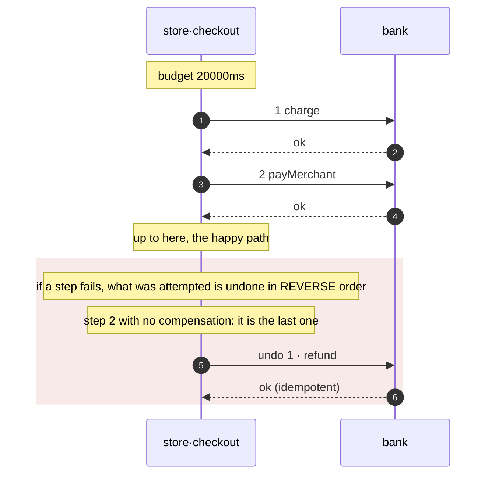

# Patterns

A pattern you have to remember to apply is not a pattern: it is a convention somebody
will break at 3am. In axon the pattern is declared and the compiler emits it. If it is
not in the generated code, it does not exist.

| Pattern | Declared with | What it produces |
| --- | --- | --- |
| **Transactional outbox** | `[patterns] outbox = true` | The emitters write into the outbox and take the caller's transaction as a **mandatory** parameter; `bus.publish` disappears from the generated code. See [below](#the-outbox-and-the-callers-transaction). |
| **Idempotent consumer** | always | `dispatch()` deduplicates by envelope id before routing. |
| **Causal chain** | always | `traceparent` + `correlationId` + `causationId` propagated by the emitter. |
| **Dead letter** | always | A subscription with a DLQ on all four targets. There is no way to declare a consumer without one. |
| **Database per service** | `[infra] state` | One database per service, and `verify` blocks any FK that crosses the boundary. |
| **Circuit breaker / timeouts** | `[[depends]]` | `timeout_ms` mandatory; retrying something non-idempotent is an error. |
| **Idempotency-Key** | `idempotent = true` | A mandatory header in the OpenAPI of every mutating method. |
| **RFC 7807** | always | One error format across the whole platform, with the `traceId` inside. |
| **Expand / migrate / contract** | the file's name | A `DROP` outside a `.contract.sql` is a `verify` error. |
| **Event sourcing** | `[aggregate.<name>]` | The append-only store, the `fold` with one case per declared event, and the optimistic versioning. An `UPDATE` on the stream is a `verify` error, no exceptions. See [below](#event-sourcing). |
| **CQRS** | `[view.<name>]` | The projection with one case per event and its checkpoint. A view that promises `strong`, or more lag than the service, is an error. See [below](#cqrs-the-read-model). |
| **Saga** | `[saga.<name>]` | The complete coordinator: order, journal, compensation in reverse order, and the sweep that resumes what was left stranded. An intermediate step with no `undo` is an error. See [below](#saga). |

The GoF patterns live one level down, in the code the team writes — that is what
[`gof-patterns`](https://github.com/Andrew-Tellez/patterns) is for, in six languages.
axon deals with the **architectural** ones: those that cross processes and that no
library inside a single language can guarantee on its own.

## The outbox and the caller's transaction

```ts
export interface Outbox<Tx = unknown> {
  stage(e: Envelope<unknown>, tx: Tx): Promise<void>;
}

// and the generated emitter, when there is an outbox:
protected emitPaymentCapturedV1(data: PaymentCapturedV1, tx: unknown, cause?: Envelope<unknown>)
```

`tx` is **mandatory**, and that is the whole point: it makes it impossible to write the
event outside the transaction that changes the state. The type stays open because the
framework does not pick a database client.

### This was broken, and here is how it was measured

The first version took the pool and opened its own connection. The result: `stage`
committed by itself, so a rolled-back transaction left the event **with no row**, and the
relay published a charge that never happened. Measured against the containers, with a
switch that blows up after the `stage` and before the `COMMIT`:

| | payments | events in the outbox |
| --- | --- | --- |
| before, with its own connection | 0 | **1** |
| now, with the caller's transaction | 0 | 0 |

An event with no row shows up nowhere until somebody asks about a charge nobody made. It
was exactly the dual-write the pattern exists to eliminate, in the code that announced it
as solved.

The check stayed in the demo as a regression guard, and the testkit requires the parameter
in the generated code: a service with an outbox has to ask for the transaction, and one
without an outbox does not — asking there would be noise, because there is no transaction
to share.

### The two tables axon names itself

`outbox` and `inbox_seen` are not a convention you may rename. `verify` exempts them from
the tenant rule by that exact name, the pooler reserves connections for the relay that
drains `outbox`, and `rls` leaves both out of the policies. So declaring the pattern and
never writing the migration is an **error**:

```
error orders: `[patterns] outbox = true` and the migrations create no `outbox` table.
      The event is staged in the same transaction as the state change, and there is
      nowhere to stage it
```

It is the one combination that applies clean and breaks on the first insert, in the path
whose whole reason to exist is that no event gets lost. The same goes for a service with
`[consumes.*]` and no `inbox_seen`: the broker delivers at least once, and with nowhere
to record what was already seen the handler runs again on every redelivery.

A service with no `[infra] state` is not asked for either one: there are no migrations
to look at.

## Saga

A saga is a sequence of steps across different services, each with its compensation,
coordinated by one of them. It is what is left when a distributed transaction is not an
option, and the price is that **between the first step and the last the system passes
through states no invariant describes**.

```toml
[saga.checkout]
on         = "checkout"    # the own method, or a consumed event, that starts it
timeout_ms = 20000         # the whole flow's budget
steps = [
  { do = "bank.charge",       undo = "bank.refund" },
  { do = "bank.payMerchant" },   # the last one carries no compensation
]
```

### What gets generated and what does not

The **complete** coordinator: the order of the steps, the journal, the compensation in
reverse order, the time budget and the exhaustive step table. What does not get generated
are each call's **inputs**, because they are business data. That is an interface you
implement, and a step left unimplemented does not compile:

```ts
export interface CheckoutOutputs {
  step1?: PaymentsCapturePaymentOut;
  step2?: PaymentsPayoutMerchantOut;
}

export interface CheckoutActions {
  /** step 1 · payments.capturePayment */
  step1CapturePayment(e: Envelope<unknown>, prior: CheckoutOutputs): Promise<PaymentsCapturePaymentOut>;
  /** undoes step 1 · payments.refundPayment · receives what the earlier steps returned,
   *  and has to tolerate there being nothing to undo */
  undo1RefundPayment(e: Envelope<unknown>, prior: CheckoutOutputs): Promise<void>;
  /** step 2 · payments.payoutMerchant */
  step2PayoutMerchant(e: Envelope<unknown>, prior: CheckoutOutputs): Promise<PaymentsPayoutMerchantOut>;
}
```

`prior` is typed with the real outputs of the declared methods —the same types each
dependency's client already emits— and it **comes from the journal, not from a variable**.
That is the difference between a saga that can be resumed and one that cannot: undoing
step 1 needs the id that step returned, and the process that had it in memory is exactly
the one that died.

That is why everything an action needs has to come from the envelope or from `prior`. A
closure works on the first pass and disappears on the resume, which is exactly when it is
needed.

The steps are invoked with the clients `[[depends]]` already generates, so they carry the
timeout, the retries and the breaker. That is why `verify` requires every step to be
declared as a dependency: without that the saga gets generated with nothing to call.

### Three decisions the coordinator makes on its own

**The step that failed is undone too.** A timeout does not say nothing happened on the
other side. Compensating only up to the last success leaves that effect applied forever.
That is why every compensation has to tolerate there being nothing to undo.

**The journal is written in two beats**: `attempting` before the call, `done` after. A
step left in `attempting` may or may not have happened, so on resume it is
**compensated**, not retried.

**A compensation that fails throws `SagaStuck`.** There is nothing behind a compensation:
if it fails, the saga is half done and needs a person. Swallowing that error leaves it
silently inconsistent, which is the worst possible outcome.

### The journal, and why it is mandatory

```sql
CREATE TABLE saga_checkout (
  id        uuid        PRIMARY KEY,  -- the flow's id; the correlationId will do
  step      int         NOT NULL,
  status    text        NOT NULL,
  data      jsonb       NOT NULL,     -- the envelope that started it
  updated   timestamptz NOT NULL      -- when it last moved
);
```

`verify` requires it and checks its columns —and the types of the last two— against the
real migrations. Without it, a restart halfway through leaves the steps already done
applied and **with no record of which ones they were**: it can neither finish nor
compensate.

The last two columns are not decoration:

- **`data`** stores the envelope that started it. Resuming without it is impossible: the
  actions need the call's data, and the process that had it in memory is exactly the one
  that died.
- **`updated`** is what tells a stranded saga from one still on its way. Stored as `text`
  the comparison compiles and sorts wrong, and the sweep **would skip stranded sagas
  without saying anything** — that is why `verify` checks the type, not just the name.

## The sweep: who calls again

The coordinator knows how to resume, but on its own nobody calls it: the process that had
the saga in flight is the one that died. Without a sweep, a saga with a step in
`attempting` stays there forever and the journal records it with nobody reading it.

There are two ways to run it, and both get generated.

**Inside the process**, with the interval derived from the budget:

```ts
const stop = startSweepCheckout(actions, journal, (r) => {
  log.info({ sweep: "checkout", ...r });
  if (r.stuck) log.error({ stuck: r.stuck });  // this needs a person
});
```

**Triggered from outside**, which is what `axon infra` deploys. The generated code
publishes the route and startup has to serve it:

```ts
export const sweepRouteCheckout = "POST /internal/saga/checkout/sweep" as const;
```

It goes over HTTP and not as a separate command because a command forces a different
entrypoint in every language, and this has to work the same in the Go generator as in the
TypeScript one. **A route is the only contract they all share.** And it is not a declared
method, so it does not go out through the gateway: it triggers compensations, it cannot be
public.

| target | what gets deployed |
| --- | --- |
| `local` | a container with `curl` in a loop, so the sweep runs here too and nobody discovers in production that the route did not exist |
| `gcp` | a `google_cloud_scheduler_job` with OIDC from the service's own account |
| `aws` | an `aws_scheduler_schedule` that launches a one-shot Fargate task **in the same subnets** — EventBridge cannot reach a private endpoint, and an API destination would have to be public |
| `k8s` | a `CronJob` with `concurrencyPolicy: Forbid`, and the service's `NetworkPolicy` lets exactly that pod in |

That last row is the one that almost shipped broken: the service's policy said
`ingress: []`, so the CronJob would have applied with no error and the `curl` would never
have arrived. The only thing that would say so is a failing job's history.

### The threshold is not a heuristic

The sweep only touches the sagas that have gone **longer than their own budget** without
moving. That number is already declared, and `verify` already checked that it covers the
sum of the steps and their compensations: a saga older than that is not on its way, it is
stranded. Sweeping sooner would be running a **second coordinator over a live saga**,
compensating steps the first one is still doing.

The interval comes from the same number: nothing becomes eligible sooner, so sweeping more
often is work with no result.

### `claim` claims, it does not list

Two instances of the service sweep at the same time. If the sweep *listed* the stranded
sagas, both would take the same one. On Postgres the claim and the filter are **one
statement**:

```sql
UPDATE saga_checkout SET updated = now()
 WHERE status IN ('attempting','done') AND updated < $1
 RETURNING id, data
```

Touching `updated` *is* the claim: the other sweeper no longer sees it. And if this
process dies halfway, the saga becomes eligible again in the next window **with nobody
unlocking it by hand** — a lock somebody has to clean up by hand is a lock somebody will
forget.

### Two things the sweep does not do

**It does not retry a `stuck` one.** A compensation that already failed needs a person;
retrying it silently hides exactly that. It is counted and left.

**It does not stay quiet when it cannot keep up.** If the pass's limit fills up, `pending`
comes back `true`. A silent cap reads exactly like "there was nothing more", and that is
the difference between a sweep that is up to date and one that is weeks behind.

```ts
export interface SweepReport {
  claimed: number;
  completed: number;
  compensated: number;
  stuck: number;     // these need a person
  pending: boolean;  // some were left for the next pass
}
```

Returning the result is what makes it measurable: **a sweep that reports nothing is
indistinguishable from one that does not run.**

### What `verify` refutes

| | |
| --- | --- |
| An intermediate step with no `undo` | that is not a saga, it is a dual-write with more steps: if a later step fails, this one stays applied forever |
| An `undo` that is not `idempotent` | a compensation is retried until it gets through —there is nothing behind it— and retrying one that is not idempotent **applies the effect twice** |
| A `do` or `undo` that does not exist | a misspelled `undo` is a compensation that does not exist, and it is discovered the day something has to be compensated |
| A step with no `[[depends]]` | the resilient client comes from there; without it the saga has nothing to call with |
| `timeout_ms` smaller than the sum of the steps and their compensations | giving up while a step is still in flight leaves the coordinator compensating something that later succeeds |
| The journal's table is missing, or a column is | see above |
| An `on` that is neither an own method nor a consumed event | a saga nobody starts is generated code that never runs |
| A step that compensates itself | |
| `consistency = "strong"` | the intermediate states are visible: the flow's real guarantee is eventual |

The only carve-out is deliberate: **the last step may omit `undo`**. If the last one
fails, there is nothing of its own to undo, and requiring a compensation there would be a
false positive — and a rule with false positives gets silenced wholesale.

### The diagram comes from the manifest

```sh
axon seq checkout manifests/
```



That the compensation draws itself is half the value of declaring it: in a review, a step
with no arrow back is visible.

## Checked by running it, not by reading it

The generated coordinator and sweep are executed with `node --test` and an in-memory
journal that honours the same contract as the Postgres one. **Ten cases**, because the way
back is exactly the one that never runs until the day it matters:

| | |
| --- | --- |
| the happy path compensates nothing | |
| if step 2 fails, step 1 is undone | and the order is the reverse |
| if step 1 fails, there is nothing done to undo | it is undone anyway: it was attempted |
| a compensation that fails leaves the saga stuck, and it shows | `SagaStuck`, journal in `stuck` |
| the last step carries no compensation, and the rest do | |
| the sweep resumes a stranded saga and compensates it | a step in doubt is not retried |
| the sweep does not touch a saga on its way | it would be a second coordinator |
| `claim` claims: the second sweeper does not see the same saga | |
| a stuck saga is counted and not retried | and it is not taken again |
| if the limit fills up, the sweep says so | |

The first bug came out of there: the coordinator compensated from the last **successful**
step and left the failed step applied. A timeout does not say nothing happened on the
other side.

## In the demo, against containers

`examples/` ships a third service, `checkout`, whose only job is coordinating the saga
over `payments`. Its database is **not sharded by tenant**, and that decision is by
design: the sweep has to be able to look at every stranded saga at once, and a query with
no shard key cannot be routed. The tenant travels inside `data`.

`payments.payoutMerchant` rejects amounts over the merchant's ceiling, which is a
realistic and deterministic business failure: it happens **after** the charge went
through. It is exactly the case that needs a saga.

```console
==> the saga: compensation and resume, measured
  a checkout below the ceiling
    {"state":"completed"}
  a checkout ABOVE the ceiling: step 2 fails after the charge
    {"state":"compensated"}
  OK: the charge was undone and the merchant was not paid
  a saga stranded in another process, resumed by the sweep
    {"claimed":1,"completed":0,"compensated":1,"stuck":0,"pending":false}
  OK: resumed from the journal, compensated, and the refund reached the charge
  OK: a closed saga is not swept again
```

The third case is the one that cannot be simulated with a closure: a saga whose step 1 was
left `done` **in another process** is inserted into the journal, with its output saved, and
the sweep's route is hit. The refund has to reach that specific charge, and the only place
the `paymentId` can come from is the journal.

That is where the bug no unit test had seen came out: the journal saves the outputs by step
**number** and the interface exposes them as `step1`. The cast from one shape to the other
compiled and left everything `undefined`, so a resumed saga's compensation refunded
nothing —and did not fail. The translation is now explicit, field by field.

And the assertions are about the **invariant**, not about counts: of that order no charge
is left standing and the merchant was paid nothing. A count accumulates earlier runs and
ends up asserting about something else.

## The retries, measured

`[[depends]]` declares `retries` per step, and the coordinator applies them through the
generated client. The demo measures that they are **exactly** those, and that they are what
decides whether a saga compensates or gets stuck.

What is declared does not come from a number written in the script: it comes from the
**generated code** —
`withPolicy("payments.payoutMerchant", { timeoutMs: 4000, retries: 2, ... })` — and the
budget, from the coordinator's `const deadline = Date.now() + 60000`. Comparing against a
copy made by hand compares nothing. What is measured comes from `payments`' `attempt`
table, which records every call that arrived.

```console
==> declared vs occurred retries
  declared in the generated code: payout 2 retries, refund 3
    {"state":"compensated"}  (14s)
  OK: 3 calls = 1 + 2 retries, exactly what was declared
  OK: 14000ms inside the 60000ms budget
    {"state":"compensated"}
  OK: 3 calls to the refund (2 failures and the one that got through), and the charge was undone
  i without the 3 declared retries, this saga ended up STUCK
    HTTP 500
  OK: 4 calls, the saga was left STUCK and the response did not hide it
```

Four things, and each one answers a different question:

| | |
| --- | --- |
| **the step retries what was declared, and not once more** | the payout takes longer than its own timeout, so every attempt times out. 3 calls arrive: `1 + retries` |
| **exhausting the retries fits in the budget** | 14000ms against the 60000ms declared. It is what makes giving up on time mean something instead of being a limit that is always crossed |
| **the compensation's retries are what saves the saga** | the refund fails twice and gets through on the third. With `retries = 3` there is margin: the saga ends up `compensated`. Without them, `stuck` |
| **exhausting them does not stay silent** | with more failures than retries, the saga is left `stuck` in the journal **and** the response is a 500. A half-done saga that returns 200 is the worst possible outcome |

The two switches that cause the failures —a slow payout and a refund that rejects the
first N times— belong to the **demo, not to the service**: they travel through
`.env.local`, which is the `env_file` the generated compose already mounts. A variable in
the shell does not reach the container if the compose does not declare it, and declaring it
there would be putting something of the demo's inside the generated infrastructure.

And the attempt log lives in `tenant_exempt` in writing: it is infrastructure of the retry
policy, not tenant data. Without that explicit declaration, the RLS rule would flag it
—correctly— and stop being useful for everything else.

## Event sourcing

The state **is** the event stream. What today lives in a row is a projection of that
stream, not the truth.

```toml
[aggregate.account]
events  = ["account.opened@v1", "account.deposited@v1", "account.closed@v1"]
machine = "account"       # optional: governs which event is legal from which state
snapshot_every = 0        # 0 = always rebuild from the beginning
```

```sql
CREATE TABLE account_event (
  id         uuid PRIMARY KEY,
  stream_id  uuid NOT NULL,
  version    int  NOT NULL,
  type       text NOT NULL,
  data       jsonb NOT NULL,
  at         timestamptz NOT NULL DEFAULT now(),
  UNIQUE (stream_id, version)
);
```

### That UNIQUE is not a detail

It is the entire optimistic versioning. Without it, two concurrent writes to the same
stream **both get in with the same version**, nobody sees an error, and the state that
gets rebuilt afterwards depends on what order the rows are read in. `axon verify` requires
it.

```console
$ axon verify manifests/
error  ledger.account: `account_event` has no UNIQUE on (stream_id, version). Two
       concurrent writes to the same stream both land with the same version, with no
       error at all, and the state that gets rebuilt depends on what order they are
       read in
```

### Append-only, and not as a recommendation

```console
error  ledger/002_fix.contract.sql: `DELETE` on `account_event`, which is the stream
       of `account`. A stream is append-only: changing a past event leaves a past that
       did not happen, and everything rebuilt afterwards will be consistent with that
       lie. To correct something you add a new event, you do not edit the old one
```

Unlike the rest of the tables, here **there is no `.contract.sql` that enables it**. A
destructive migration on a normal table is a decision you mark and review; on an event
stream it is a contradiction with what the stream means.

### What gets generated and what does not

The mechanical part gets generated: `append` with an expected version, the rehydration,
and the `switch` with one case per declared event. How each event changes the state is
written by whoever knows:

```ts
export interface AccountRules<AccountState> {
  initial(streamId: string): AccountState;
  applyAccountOpenedV1(state: AccountState, e: AccountOpenedV1): AccountState;
  applyAccountDepositedV1(state: AccountState, e: AccountDepositedV1): AccountState;
  applyAccountClosedV1(state: AccountState, e: AccountClosedV1): AccountState;
}
```

A declared event with no case **does not compile**. It is the only way that adding an
event to the manifest does not leave the old `fold` running in silence, returning an
incomplete state nobody can tell from a correct one.

And the generated `fold` does not assume the order: **a gap in the versions blows up**.
Rebuilding while skipping an event gives a state that never existed, and it is
indistinguishable from a real one.

```ts
if (ev.version !== version + 1) {
  throw new Error(`account/${streamId}: expected version ${version + 1} and got ${ev.version}`);
}
```

### The state machine, if there is one

`machine = "account"` connects the aggregate with `[machine.account]`, and then `verify`
requires that **every event of the aggregate be emitted by some transition**. Two
vocabularies for the same concept drift apart on the first change; with this rule, they
cannot.

## CQRS: the read model

```toml
[view.balances]
on = ["account.opened@v1", "account.deposited@v1"]
max_staleness_ms = 3000
```

What declaring it adds is not the code —a projection is a `switch`— but that the compiler
enforces what nobody enforces:

| | |
| --- | --- |
| it is built with an event nobody emits | the view gets generated and never receives anything |
| it uses another service's event with no `[consumes]` | the subscription comes from there; without it, the same |
| its table, or the checkpoint's, is missing | see below |
| `consistency = "strong"` | a view is filled **after** the event happened: what it serves is stale by definition |
| `max_staleness_ms` greater than the service's | the service cannot honour what it promised by serving from a view older than its own budget |

### The checkpoint, and why the write is not in the interface

```ts
export interface Checkpoint {
  read(view: string, streamId: string): Promise<number>;
}

export interface BalancesProjection {
  /** account.opened@v1 · saves `position` in the SAME transaction as the effect */
  applyAccountOpenedV1(e: Envelope<AccountOpenedV1>, position: number): Promise<void>;
  ...
}
```

The position **has to be saved in the same transaction as the view's effect**, and that
transaction belongs to the projection, not to the framework. That is why `Checkpoint` only
knows how to read: the position travels to each `apply*`, which saves it along with the
rest.

If they were two transactions, a cut between them leaves the view ahead of or behind what
it claims to have applied — and neither of those raises an error. With no checkpoint at
all, a restart reprocesses from the beginning or skips what it did not get to apply.

## The fold, checked by running it

The generated `fold` and projection are executed with `node --test`. **Ten cases**, and the
three that matter are the ones a `switch` read by eye cannot tell apart:

| | |
| --- | --- |
| the state comes from the stream, not from a row | |
| **a gap in the versions blows up** | instead of giving a state that never existed |
| **an event the manifest does not declare is not ignored** | ignoring it gives a wrong state with no error |
| from a snapshot, the `fold` carries on from there | |
| the aggregate's events are the manifest's | |
| **the view only accepts the events it declares, and the position reaches it** | one event too many would come from a subscription nobody asked for |

## In the demo, against Postgres

`checkout` declares `[aggregate.checkout]` and `[view.conversion]`, and the demo measures
the two claims a unit test cannot sustain:

```console
==> event sourcing and CQRS, measured
  OK: one got in and the other was rejected; 1 event left at version 3
  i the rejection is the UNIQUE, not a check in the application
  OK: the view agrees with the stream
  OK: 1061ms of real lag; the unprojected event shows up
  OK: 0ms, inside the declared budget of 3000ms
```

**The optimistic concurrency.** Two `INSERT`s at the same version, at the same time, with a
`pg_sleep` inside each transaction to overlap them on purpose. One gets in, the other is
rejected by the UNIQUE — not by a check in the application, which is the difference
between a guarantee and an intention.

**The lag, measured from the stream and not from the view.** This was wrong in my first
version: it measured the age of the event the view had already applied, and that always
gives a pretty number —precisely when the projection is stopped. The real lag is the age of
the **oldest event the projection has not applied yet**, and it comes from the stream.

And it is measured in both directions, because a measurement that has only been seen
passing has not been seen working: over a stream with an event injected without going
through the projection it has to **see** the lag, and over an up-to-date checkout it has to
fit in the budget.

### The relay, and why `verify` requires it

With event sourcing the stream is already durable, so **nobody publishes inline**:

```console
$ axon verify manifests/
error  checkout.checkout: an aggregate whose events get published needs `[patterns]
       outbox = true`. The stream is already durable, so publishing inline leaves a
       window where the event is recorded and nobody received it, and publishing before
       recording leaves the opposite. The handoff goes in the SAME transaction as the
       append
```

The two rows —the stream's event and the outbox's— get in inside **one** transaction, or
neither does. The stream is the truth; the outbox is the delivery. And since the outbox is
not the stream, the relay can mark what it published without violating append-only: that is
why two tables are needed and not one with a `published` column.

The generated `Outbox` fits here exactly because `stage` takes the caller's transaction:
`append` opens the transaction, inserts the event and hands that same transaction to
`stage`. When `stage` opened a connection of its own, a second transaction was precisely
the problem this avoids — and it was measured before being fixed.

And a consequence of the order: the expected version comes from **reading** the stream, not
from a counter in memory. With two instances, a local counter drifts and the UNIQUE is the
only thing that says so.

What that buys, measured: an event recorded **with the relay down** gets published when it
comes back, and nobody has to retry it by hand.

```console
  an event recorded with the relay down
    1 event(s) recorded and unpublished
  OK: the relay came back and published it; nobody had to retry by hand
```

The demo checks it in both halves: that the outbox's row ends up marked, **and** that the
envelope shows up in the bus's log. Marking without publishing is the silent failure a
`published_at` on its own cannot tell apart.

## The snapshots, and why they carry a rules version

Rebuilding from the beginning works until a stream has a hundred thousand events.

```toml
[aggregate.checkout]
events = ["checkout.started@v1", "checkout.charged@v1", "checkout.compensated@v1"]
snapshot_every   = 50
snapshot_version = 1
```

A snapshot is a **cache of the `fold`**: every one of them can be deleted and the system
stays correct, only slower. That is what tells it apart from the stream, and also where its
only real danger comes from.

**The dangerous part is not a snapshot being missing** —that costs time— **but it being
wrong.** If the `fold` changes —a new rule, a field now accumulated differently— the old
snapshots encode the previous version. Rehydrating from there gives a state that no longer
matches replaying the stream, and that raises no error: it gives a wrong number.

Hence `snapshot_version`. It goes in the table, and `snapshot()` returns **only** the ones
of the current version:

```sql
CREATE TABLE checkout_snapshot (
  stream_id  uuid  NOT NULL,
  version    int   NOT NULL,
  rules      int   NOT NULL,   -- which version of the rules it was computed with
  state      jsonb NOT NULL,
  at         timestamptz NOT NULL DEFAULT now(),
  PRIMARY KEY (stream_id, version, rules)
);
```

`verify` requires that column with that reasoning in the message. Bumping the number
invalidates the existing snapshots and makes them rebuild: it is the only thing that turns
"the snapshot went wrong" into "the snapshot gets rebuilt" — the difference between a wrong
number and a slow query.

### The cycle gets generated, with the numbers inside

```ts
export const checkoutSnapshotEvery = 50;
export const checkoutSnapshotRules = 1;

/** From the last valid snapshot, and only the rest of the stream from there. */
export async function checkoutLoad<E>(rules, stream: SnapshottingStream, streamId)
/** Snapshots if it is due. Returns whether it saved one, so it can be measured. */
export async function checkoutSnapshot<E>(stream, streamId, version, state)
```

Both numbers come from the manifest: nobody types them twice. And `SnapshottingStream` is
only generated if the manifest declares snapshots — in `EventStream` they were optional
methods, and declaring snapshots without implementing them compiled and did nothing.

A detail about the order: the snapshot is taken **after** the append and from a freshly
rebuilt state. Snapshotting what was believed to be the state before writing would save a
snapshot of something that did not end up in the stream.

### Measured

```console
  OK: snapshot at version 2, a multiple of the declared cadence (2)
  OK: the snapshot says 'compensated' and the projection, which did not use it, says the same
  OK: the rules 0 snapshot lives alongside the current one, which says 900 cents
```

The second one is the one that matters: **the snapshot against the view**, which was built
event by event without using snapshots. If they differed, the cache would be lying.

And the testkit proves what the demo cannot: that a snapshot from another rules version
**is not used**. `load` is given a stream with a saved snapshot of the wrong version, one
that would say 99999 cents, and the state has to come from the whole stream: 750.

`snapshot_every = 1` is a warning, not an error: saving a snapshot per event is not a
cache, it is a second copy of the stream with twice the writes.

### Deleting the old ones

`snapshot_version` invalidates the old snapshots but does not remove them, so the table
grows with every rules version. The prune deletes **what the current version does not
use**: those of another rules version, and all but the newest of each stream.

```ts
export const pruneRouteCheckout = "POST /internal/aggregate/checkout/prune" as const;
export async function pruneCheckout(stream: SnapshottingStream): Promise<number>
```

And `axon infra` deploys it on all four targets, with the same machinery as the saga's
sweep. The interval —one hour— **does not come from the manifest**, and that is deliberate:
there is nothing there to derive it from, because the snapshot cadence is measured in
events and not in time. Falling behind only costs space.

It can be aggressive for one concrete reason: **a snapshot is a cache, so the prune cannot
break correctness, only performance.** The worst that happens is rebuilding from the
stream, which is slow and correct. Deleting too much breaks nothing; never deleting makes
the table grow forever.

One detail: it is **a single statement**. In two —first those of another version, then the
old ones— a prune interrupted halfway leaves a state nobody thought about. And there is no
race with whoever is rehydrating, because `snapshot()` returns the state **by value**:
deleting the row afterwards takes nothing away from them.

```console
  the prune of the snapshots the current version does not use
    10 snapshots, deleted 2, 8 left
  OK: the ones from another version are gone, and only the newest of each stream is left
  and the state after running out of snapshots
  OK: with no snapshot at all the system stays correct, it just rebuilds more
```

That last line is the one that holds everything else up: the demo **deletes every snapshot**
and makes another checkout. If the system depended on them, it would stop working; since
they are a cache, it just rebuilds more.

## Rebuilding the view from scratch

It is the operation that turns a read model into something whose **shape** can be changed
without a migration: change the projection, rebuild, and there is no `ALTER TABLE`
preserving data that can be recomputed.

```ts
export const rebuildRouteConversion = "POST /internal/view/conversion/rebuild" as const;
export async function rebuildConversion(
  shadow: ConversionProjection & Shadow,
  stream: EventStream & StreamSource,
): Promise<number>
```

**It carries no cron**, unlike the saga's sweep and the snapshot prune: rebuilding is not
periodic, it is an operation somebody decides on.

### It is only generated if it can be

The function exists **only** when every event of the view belongs to an aggregate of its
own. The ones that arrived over the bus are gone —they were consumed— so a view over
somebody else's events cannot be rebuilt from anything local. Its absence is the answer to
"can this view be rebuilt?", at compile time instead of on the day it is needed.

### Three decisions, and one limitation said out loud

**`prepare` deletes the rows AND sets the position to zero, in one transaction.** In two
steps, a rebuild interrupted between them leaves an empty view claiming to be up to date —
and that raises no error, it gives empty answers.

**The dates are the stream's.** Filling `event_at` with the hour of the rebuild would
rewrite history in silence, so `StreamEvent` carries its `at` and the rebuild puts it back.
The testkit checks it with a date from 2020.

**An event the view does not declare is skipped, it does not blow up**: it is in the stream
by its own right, and a view is built with the ones it declares.

And the limitation, written in the generated code's doc comment: the walk is **per stream
and in version order**. A projection whose result depends on the order *between* streams
needs a total order the stream does not have.

### The shadow: nobody sees a half-built view

Rebuilding in place leaves the view incomplete while it runs, and it keeps being read:
whoever asks gets **fewer rows than there are, with no error at all**. So the rebuild is
done in a shadow and swapped all at once at the end.

```ts
export interface Shadow {
  /** Leaves the shadow empty, with its position at zero. */
  prepare(): Promise<void>;
  /** Swaps the shadow for the live one, and its position with it, in ONE transaction. */
  swap(): Promise<void>;
}
```

**The shadow is another instance of the projection, not a mode.** A mode stays switched on,
and the next live projection would write into the shadow with nothing saying so. The
instance carries its table and its view name, and there is no state to forget to switch
off.

The swap is two `RENAME`s and the handover of the position, all in one transaction —
Postgres allows transactional DDL, so whoever reads waits a few milliseconds instead of
seeing a half-built view. In two transactions, a cut between them leaves **the new table
with the old one's position**: it would skip events or reprocess them, and nothing would
say so.

What the type cannot prevent: handing `rebuild` a projection pointed at the **live** view.
That would be a rebuild in place with extra steps — and that is why the demo measures the
window instead of trusting the signature.

```console
  the reads while the view is being rebuilt
    24 reads during the rebuild; lowest seen: 18 of 18
  OK: nobody saw a half-built view; 43 events applied in the shadow
  i rebuilding in place, the lowest would have been 0
```

It is measured by stretching the rebuild on purpose: without that it finishes in
milliseconds and "nobody saw anything" cannot be told apart from "nobody looked". And the
testkit pins the order: `prepare` first, `swap` at the end.

### Measured by dirtying the view

```console
  the view, dirtied on purpose and rebuilt
    10 rows with garbage
  OK: it applied 25 events of the stream's 25, and no garbage was left
  OK: every rebuilt row matches the last event of its stream
  OK: the dates came from the stream, not from the hour of the rebuild
```

If the rebuild did not fix the garbage, it would not be rebuilding anything.

## A view's checkpoint is per stream

This came out of running the demo **twice in a row**, and it was a design mistake of mine:
the checkpoint saved a single number for the whole view, and an event's version is its
position inside **its** stream. With one stream it seemed to work; with several it
identifies nothing, and the view skips events or reprocesses them with nothing warning
about it.

```console
error  checkout.conversion: `view_conversion_checkpoint` has no key on (view_name,
       stream_id). One stream would overwrite another's position, and the view would
       skip events or reprocess them without anything warning about it
```

And fixing it uncovered a bigger gap: **the schema reader did not fold `ALTER TABLE ADD
PRIMARY KEY`**. A key added in a later migration was invisible, so *every* uniqueness rule
—the event stream's, the sharding ones, this very one— took it as absent and passed in
silence. It folds now, and there is a test that pins it. The same applied to
`ALTER TABLE ... RENAME`, found the same way.

### And `verify` checks that they match

The shadow is one more table in the migrations, written by hand. One with a column fewer
makes the swap leave an **incomplete** view, and that would be discovered on the day of the
rebuild:

```console
error  ledger.balances: `view_balances_shadow` has no `cents` column, which
       `view_balances` does. The swap would leave a view without that data, and only
       then would it show
error  ledger.balances: it can be rebuilt and `view_balances_shadow` is missing.
       Rebuilding in place leaves the view incomplete while it runs, and it keeps being
       read: whoever asks gets fewer rows than there are, with no error
```

And a different type between the two is an error too: on the swap, the view changes type
with nothing saying so. A column too many in the shadow is only a warning — it is spare
until the next swap, and after that it is the view that has it.

## The search index: the same copy, listed instead of looked up

A search index is a cache with a worse failure. A stale cache serves one wrong answer to
whoever asked for that key. A stale or unfiltered index **lists** rows — somebody else's,
or rows that no longer exist — and nobody asked for them by name, so nothing about the
answer looks wrong.

```toml
[search]
engine = "meilisearch"

[search.items]
of         = "item"                     # the table, which has to be in a migration
key        = "itemId"                   # the field the events use
key_column = "id"                       # what it is called in the table
fields     = ["name"]
filter_by  = ["tenantId"]               # every query, always
reindexed_by = ["item.changed@v1"]
```

| The rule | What it prevents |
| --- | --- |
| the tenant is in `filter_by` | a query that answers with **other tenants' rows**, as a list |
| the key is a field the event carries | a reindex that cannot say which document changed |
| something reindexes it | an index that lists what was true the day it was built |
| every field is a column | a document with holes, built against a table that never had it |
| `pii` indexed only if named in `pii_indexed` | a second copy of personal data outside the database that nobody decided to make |
| `strong` and an index is a contradiction | between the write and the reindex it lists what was true before |

The `pii` one is the interesting shape: looking a customer up by e-mail is a **real need**,
so it is not forbidden. It is named — the way `tenant_exempt` names a table — and then it
is a decision somebody took instead of one nobody saw.

### What comes out

The filter is **in the signature** and not a parameter with a default:

```ts
searchItems(search, "blue chair", { tenantId }, 20)   // no tenant, no compile
```

It returns **ids**. What the row says is the database's answer, not the index's: an index
that also serves the content is a second source of truth, and the day it lags it disagrees
with the row it points at. And `reindexItems` loads from the row rather than building the
document from the event — an event carries what *changed*, and a document built from it
holds whatever the last event happened to mention. If the row is gone, the document goes:
a document that survives its row is a search result that 404s when somebody opens it.

It comes up on `local` and on `k8s`. On `gcp` and `aws` it **refuses**, and the reason is
worth stating: there is no managed Meilisearch, and rendering an OpenSearch domain instead
would be axon choosing a different query language, a different filter syntax and a
different failure mode behind the manifest's back.

## The CRUD, and the five rules it inherits

The five endpoints with no business logic, that every service rewrites anyway: create,
read, update, delete, list. By hand they are five routes, five scopes, five entries in the
OpenAPI and five chances to forget the tenant in the `WHERE`.

```toml
[crud.item]
table = "item"                                   # it has to exist in the migrations
key   = "itemId"                                 # `key_column = "id"` by default
path  = "/v1/items"
fields = { name = "string", price = "money" }
read_scope  = "items:read"
write_scope = "items:write"
write_roles = ["admin"]
```

They expand into ordinary `[methods.*]` **before anything else reads the manifest**, so
`verify`, the OpenAPI, the testkit, the edge and the generated client work on them with no
new machinery. Which also means they inherit every rule that already applies to a method,
and two of those shaped the design:

- the create **takes the key from the caller**, because axon refuses a mutation that is not
  idempotent — a client retry would duplicate the row, and a server-generated id is exactly
  what makes that impossible to fix;
- the list **pages by cursor**, because an offset breaks as the table grows.

What makes declaring it worth anything is not the typing saved. The compiler already reads
the migrations with a real SQL parser, so:

| The rule | What it prevents |
| --- | --- |
| the table is in a migration | five endpoints that come out and fail on their first query |
| every field is a column (`money` is two) | an `INSERT` that fails the first time somebody calls it |
| the key is covered by a PRIMARY KEY or UNIQUE | the read returns *one of* several rows and the update writes to *all* of them |
| the table carries the `tenant_column`, or is exempt | a CRUD is exactly where the `WHERE` gets forgotten |
| reads and writes are different scopes | a token issued to read deletes a row |

### Overriding one

Declare the method by hand and it wins, whole:

```console
$ axon crud manifests/shop.toml --expand      # what it would generate, ready to paste
```

Copy the one you want to change, edit it, and it replaces the generated one. There is no
partial override —"the same but with another `out`"— on purpose: that is a second language
with its own merge rules, and the day the two disagree nobody knows which one is serving.

## The catalog: one list in three places

Currencies, statuses, reasons, countries. The list nobody thinks is worth declaring, so it
ends up written three times —an enum in one service, a `CHECK` in a migration, a dropdown
in the front— and the day somebody adds a value, two of the three do not hear about it.

```toml
[catalog.currency]
key = "code"
fields = { code = "string", name = "string", decimals = "int" }
entries = [
  { code = "MXN", name = "Peso mexicano", decimals = 2 },
  { code = "USD", name = "US Dollar", decimals = 2 },
]
```

Out of that come the three places, from one declaration:

- **the table and its seed** (`axon catalog`), as a repeatable migration: regenerated whole
  whenever somebody adds a value, which as a versioned migration would be a checksum
  mismatch and nothing applied;
- **the delete of what is no longer declared**, which is the part that keeps them the same
  list — without it the code stops offering a value the database still accepts, and nobody
  sees the difference;
- **the type** (`axon build`): a union where a value off the list does not compile, the
  frozen table, and a lookup.

The entries live in the manifest on purpose. A catalog whose values exist only in the
database is a catalog nobody can review — adding one is an `INSERT` somebody ran, instead
of a diff somebody read — and the code cannot know them either.

What `verify` refuses: an entry with a hole (a `NULL` where the generated type promises a
value), a field that is not declared (it would be dropped in silence), a repeated key (the
upsert makes the second one win quietly), a value whose type does not fit (a row that fails
to insert the day somebody applies it, not the day somebody writes it), and a catalog in a
service with no database — half of what declaring it buys is that the database knows it
too.

```console
==> el catalogo declarado, en la tabla y en el tipo
  OK: las 3 monedas declaradas estan en la tabla, sembradas por el job que el target emite
  una moneda retirada del manifiesto
  OK: el valor retirado desaparece de la tabla; sin eso el codigo deja de ofrecerlo y la base lo sigue aceptando
```

## The cache, and the half nobody writes

A cache is not another storage engine: it is a **derived copy**, and the only hard part is
knowing when it stopped being true. That is the one thing axon knows and a library cannot,
because the events are declared:

```toml
[cache]
engine = "valkey"

[cache.item]
of = "getItem"                        # the answer that is cached
key = ["tenantId", "itemId"]          # fields of that method's `in`
ttl_ms = 2000
invalidated_by = ["item.changed@v1"]  # what makes it stale
enabled_by = "cache_items"            # the switch
```

Everything checked here exists because of a failure **with no symptom**: the wrong answer,
served fast, with every dashboard green.

| The rule | What it prevents |
| --- | --- |
| the tenant is in the key, if the service is multi-tenant | the first tenant warms the entry and the next is served their data **as a hit** — neither the RLS nor the router sees that second query |
| the key is buildable from the event | the `del` runs, deletes nothing, and the stale answer is served until the TTL |
| the service emits or consumes what invalidates it | an invalidation nobody can run, which reads as handled |
| `ttl_ms + stale_ms` fits `[cap] max_staleness_ms` | the budget is the promise and these are what keep it |
| `strong` and a cache is a contradiction | a cache is eventual by construction: between the change and the invalidation the old answer is served |
| `pii` in the answer needs a bound | personal data kept forever somewhere nobody lists when a deletion request arrives |
| `strategy = "refresh"` needs the whole answer in the event | the entry is rewritten with a hole, and a hole is served exactly like data |
| the compensation invalidates too | after a rollback the cache keeps serving the value of the attempt that was undone |

That last one is the distributed-transaction case, and it is derivable because
`compensates` is declared: a step succeeds, the cache is invalidated and warmed with the
new value, the saga fails and compensates — and nothing tells the cache.

### What comes out

`axon build` emits the key builder, the wrapper with its TTL and its single-flight, and
`invalidateOn`, wired into `dispatch`. The key is built **there** and not at the call site:
a key assembled two slightly different ways in two places is a miss that looks like a cold
cache forever. What you write is a `Cache` with three methods — the example's adapter is
RESP over a socket, about thirty lines, no dependency.

### The switch, and the loop it plugs into

`enabled_by` is a declared flag, so the day the invalidation turns out to be wrong the
cache goes off **without a deploy**. And once it is behind a flag, the loop that already
exists closes: a `[rules.*]` over a metric can be what turns it off.

### Measured, not declared

```console
==> la cache, medida
  OK: la entrada existe con el inquilino EN la llave, no solo el pedido
  OK: entradas distintas por inquilino; sin el en la llave la segunda seria un acierto ajeno
  OK: expira en 1635ms; el TTL sale del manifiesto y cabe en el max_staleness_ms
  OK: con la bandera en off no se cachea nada; se apaga sin desplegar
```

Against the Valkey the `local` target brings up: the key is read back out of the engine,
and the second tenant asking for the **same** item is checked to get its own entry.

## What is missing from event sourcing

Nothing pending that is a correctness risk. What is left is convenience: today the shadow
and its swap are written by hand in each service, and they could be generated for Postgres
— `verify` already knows both tables and knows that they match.
