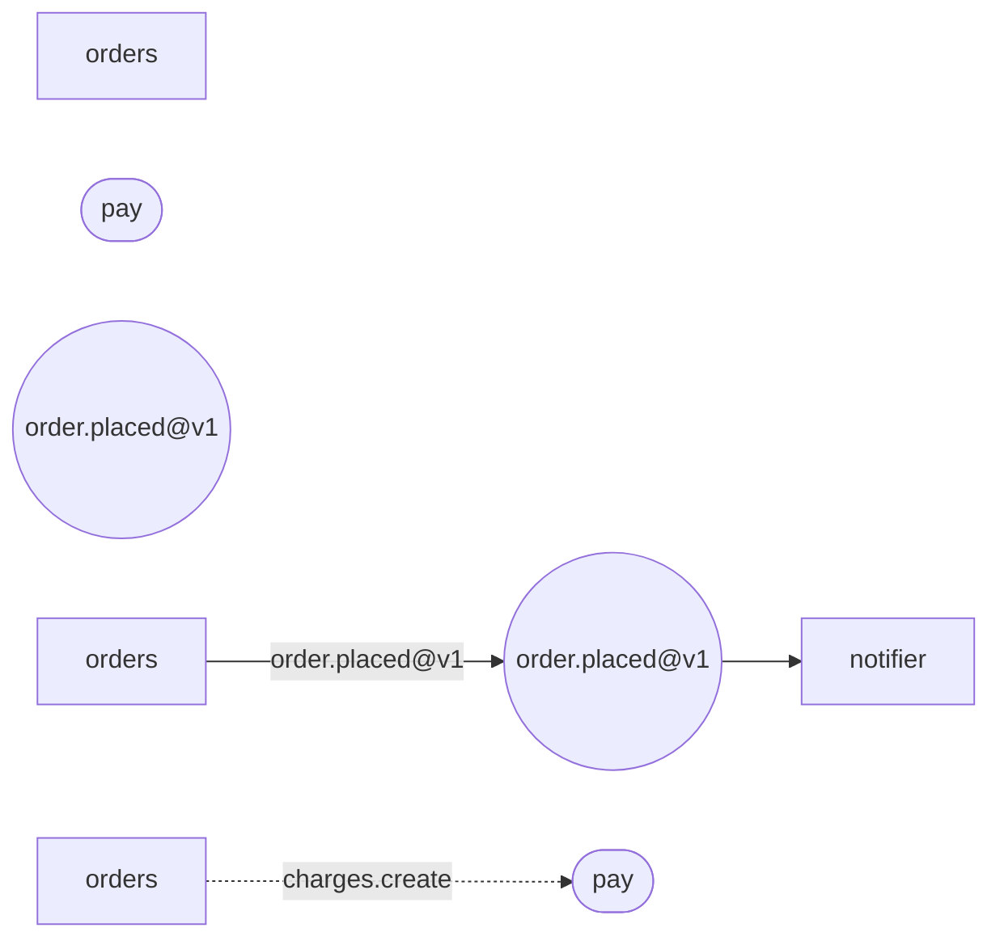

# Playground

The compiler runs **in this tab**. There is no server behind it and no prerecorded
output: `axon verify` is compiled to WebAssembly, so what this page says is what CI would
say about the same files.

Three services and one migration. They are clean —zero errors, zero warnings— and the way
to learn what axon checks is to **break them**. Each button breaks exactly one thing; the
rule that fires is the lesson. The editor is yours too.

The diagram under the editor is `axon graph`, redrawn as you type. It is not decoration
and nobody maintains it: it comes out of the same manifests the report is about, which is
the whole argument —an architecture diagram drawn by hand is a diagram that is already
wrong.

## What the drawing is saying

Four shapes and two kinds of arrow. That is the whole vocabulary:



| | |
| --- | --- |
| `["orders"]` a box | **A service of yours.** It has an owner, a criticality and a declared side of the CAP theorem, and axon generates its contracts |
| `(["pay"])` a rounded box | **An external service.** Nobody compiles it here; its contract is frozen in a `*.external.toml` so `verify` can say whether your client and the provider still agree |
| `(("order.placed@v1"))` a circle | **An event, and the topic it travels on.** Its name carries its version: `@v1` is part of the contract, and a change that breaks it is a new one |
| `A -->|"event"| B` a solid arrow | **Publish and read.** Into the circle is whoever emits it; out of it, whoever consumes it. An event with no arrow out is a contract nobody holds up, and `verify` says so |
| `A -.->|"method"| B` a dotted arrow | **A synchronous call.** The dotted line is the point: it is coupling in time. What it costs when it fails —the timeout, the retries, the breaker— is declared next to it |

**What is not in this picture, and where it is.** The database, the cache, the search
index, the pooler and the buckets are declared in the manifest too, but they are not
topology: they are what each service holds, not how services reach each other. They show
up in the other projections —`axon er` draws the schema the migrations really create,
`axon infra` renders them as infrastructure— and each one is described in
[the manifest reference](./manifest.md).

<div class="pg">
  <div class="pg-bar">
    <span id="pg-ex"></span>
    <button id="pg-reset">back to the original</button>
  </div>
  <p id="pg-hint" class="pg-hint"></p>
  <div class="pg-tabs" id="pg-tabs"></div>
  <textarea id="pg-src" spellcheck="false" rows="24"></textarea>
  <p class="pg-head">the topology · what the manifests say, drawn</p>
  <div id="pg-graph" class="pg-graph"></div>
  <p class="pg-head">the report · <span id="pg-count">compiling…</span></p>
  <ul id="pg-out"><li>loading the compiler…</li></ul>
</div>

<script type="module" src="playground/app.js"></script>

## What is not here

With no filesystem, the web build leaves out two things the CLI does look at: the
`Dockerfile` the compose expects, and any migration you do not hand it as text.
Everything else —the guarantees, the event topology, the contracts, the schema, the
scopes, the retention— is the same code.

And there are no generators: `build`, `infra`, `openapi` and the diagrams live in the
CLI. This page is for understanding **what gets checked**, not for generating a repo.
For that:

```sh
curl -fsSL https://axon.andrewtellez.dev/install.sh | sh
```
